# Architecture

Versifai is an autonomous, LLM-powered framework with three specialized AI agents that discover, engineer, validate, and analyze data on Databricks Unity Catalog -then write a narrative report from the results.

This page walks through the architecture from the top down: the overall pipeline, the core abstractions, how tools work, and finally a complete tool-level walkthrough of a real run.

---

## The Pipeline

Three agents run in sequence. Each one reads from what the previous agent produced.

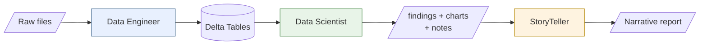

Each stage has exactly three moving parts:

| Part | What It Is | What Changes Between Projects |
|------|-----------|-------------------------------|
| **Config** | A Python dataclass holding all domain knowledge | Everything -this is where your project lives |
| **Agent** | A generic Python class that reads the config and does work | Nothing -agents are reusable across projects |
| **Notebook** | A Databricks notebook that creates the agent and runs it | Just the import path to your config |

The agents are generic. **All domain-specific knowledge lives in configs.** You never modify agent code -you write new configs.

---

## Core Abstractions

Before diving into how each agent works, here are the building blocks everything is built on.

### The ReAct Loop

Every agent runs using the same execution pattern: **Reason → Act → Observe → Repeat.**

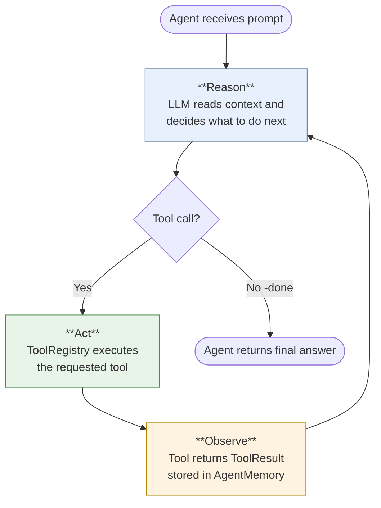

The agent never executes arbitrary code. It reasons about what to do, calls a tool, observes the result, and reasons again. This loop continues until the agent decides it's done or hits a turn limit.

### Tools -The Unit of Capability

Tools are how agents interact with the world. Every tool follows the same contract:

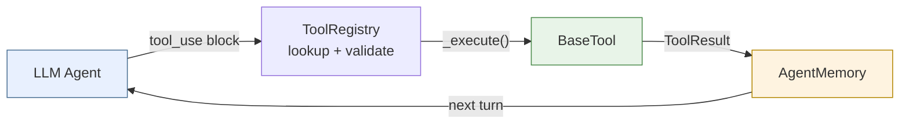

Every tool:

- Has a **name**, **description**, and **parameter schema** (JSON Schema)
- Implements `_execute()` which does the work and returns a `ToolResult`
- Is registered in a `ToolRegistry` at agent construction time
- Can be tested in isolation -no LLM needed for unit tests

### How Tools Are Registered

At construction time, each agent builds a `ToolRegistry` with the tools it needs. The registry handles dispatch and generates the tool definitions the LLM sees.

```python
from versifai.core.tools.registry import ToolRegistry

# Each agent builds its own registry
registry = ToolRegistry()
registry.register(VolumeExplorerTool(cfg=cfg))
registry.register(DataProfilerTool(cfg=cfg))
registry.register(SchemaDesignerTool(cfg=cfg))
# ... more tools

# The registry generates the schema the LLM sees
tool_definitions = registry.to_claude_tools()

# When the LLM calls a tool, the registry dispatches it
result = registry.execute(tool_name="profile_data", tool_input={...})
```

### ToolResult -The Standard Return Type

Every tool returns a `ToolResult`. This is the only way tools communicate back to the agent:

| Field | Type | Purpose |
|-------|------|---------|
| `success` | `bool` | Did the operation complete? |
| `data` | `Any` | Result payload (dict, list, string) |
| `error` | `str` | Error message if `success=False` |
| `summary` | `str` | Human-readable summary for the agent |
| `image_path` | `str` | Path to PNG for inline display |

Tools never raise exceptions. They always return a `ToolResult`, even on failure. This keeps the ReAct loop stable -the agent sees the error and can reason about what to do next.

### AgentMemory -Context Management

The `AgentMemory` class manages conversation history and prevents context overflow:

- **Auto-summarization** -at 30 messages, older messages are compressed
- **Tool result trimming** -large results older than 10 messages are truncated to 300 chars
- **Per-source reset** -history clears between sources, but decisions carry forward

---

## Tool Inventory by Agent

Each agent has a specialized toolkit. Some tools are shared across agents.

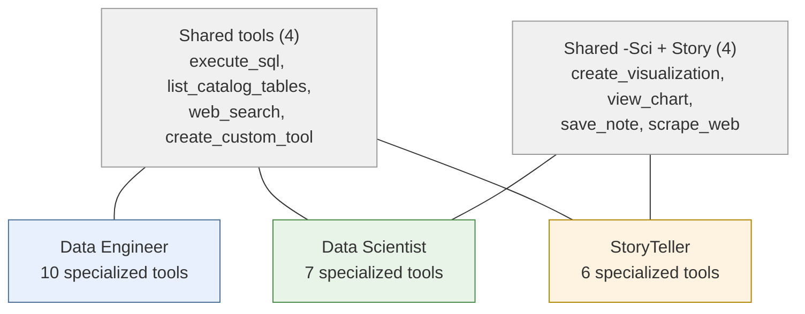

!!! note "SQL Write Protection"
    The Data Engineer gets full SQL access (`ExecuteSQLTool`). The Data Scientist and StoryTeller get a write-protected variant (`SilverOnlyExecuteSQLTool`) that blocks DDL/DML on anything except `silver_*` tables. SELECT queries are unrestricted for everyone.

For the complete parameter and return type reference for every tool, see the [Tool Inventory](tool-inventory.md).

---

## Data Engineer Agent -Deep Dive

The Data Engineer is the first agent in the pipeline. It takes a directory of raw files and turns them into clean, validated Delta tables in Unity Catalog.

### Phases

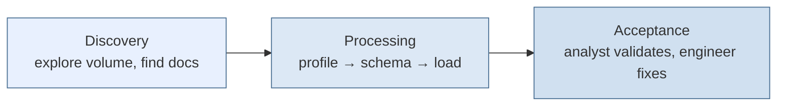

### Tool-Level Walkthrough

Imagine a Volume containing weather CSVs, a zipped duck observation archive, and an Excel file of ice cream sales. Here's exactly what the agent does:

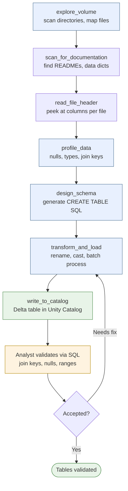

### Key Behaviors

**Smart resume** -If the notebook crashes after loading 2 of 4 sources, re-running skips the completed sources. The agent queries Unity Catalog for existing tables and compares loaded files (via `source_file_name` metadata) against current directory contents. See [Run Management & Reproducibility](run-management.md) for the full resume system.

**Batch transform** -For sources with many files (e.g., 45 monthly CSVs), `transform_and_load` supports batch mode -pass a `files` array to process everything in one tool call.

**Auto-flush** -When staged data exceeds 30M rows, the tool auto-flushes to parquet on the staging volume and clears memory. The final `write_to_catalog` creates the Delta table from all accumulated parquet batches.

**Three-tier write strategy:**

| Data Size | Method | Why |
|-----------|--------|-----|
| ≤ 2M rows | `spark.createDataFrame()` | Fast, in-memory |
| > 2M rows | Pandas → temp parquet → Spark SQL | Avoids gRPC protobuf limits |
| Auto-flushed | Spark reads parquet directory | Already on disk |

---

## Data Scientist Agent -Deep Dive

The Data Scientist reads from the Delta tables the engineer created, builds analytical datasets, runs statistics, fits models, and saves structured findings.

### Phases

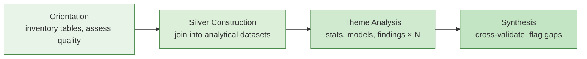

### Tool-Level Walkthrough

Here's what the agent does for a single research theme -"Does quack frequency correlate with next-day rain?"

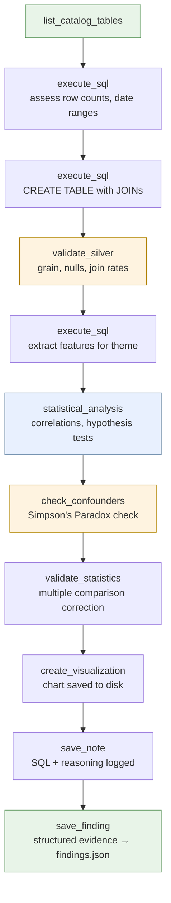

### Key Behaviors

**Theme-driven analysis** -Each theme in the `ResearchConfig` is a self-contained research question with methodology steps, required tables, expected outputs, and a signature visualization. The agent executes themes in sequence order.

**Evidence tiers** -Every finding is classified by statistical strength:

| Tier | Criteria | Used For |
|------|----------|----------|
| DEFINITIVE | p < 0.001, large effect size | Primary conclusions |
| STRONG | p < 0.01, medium+ effect | Leading findings |
| SUGGESTIVE | p < 0.05 | Supporting evidence |
| CONTEXTUAL | Descriptive, no hypothesis test | Background context |
| WEAK | p ≥ 0.05, negligible effect | Limitations, caveats |

**Confounder detection** -`check_confounders` decomposes aggregate relationships into subgroups to detect Simpson's Paradox -where the overall trend reverses within every subgroup.

**Reproducibility** -Every SQL query, statistical test, and chart is logged to per-theme notes files via `save_note`. A human can follow the exact reasoning path without the AI. See [Run Management & Reproducibility](run-management.md) for the full artifact and notes system.

---

## StoryTeller Agent -Deep Dive

The StoryTeller reads the scientist's outputs (findings, charts, tables, notes) and produces a narrative report grounded in statistical evidence.

### Phases

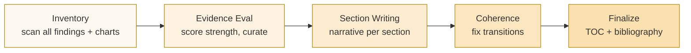

### Tool-Level Walkthrough

Here's how the StoryTeller writes one section of the report -the "Duck vs. Doppler" showdown:

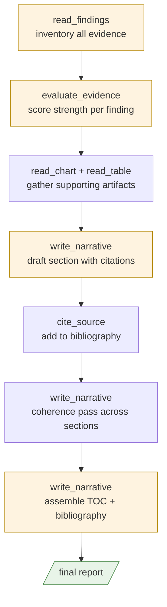

### Key Behaviors

**Evidence-grounded writing** -The StoryTeller cannot make claims that aren't backed by findings. `evaluate_evidence` scores each finding's statistical strength and `curate` ranks them for each section's purpose.

**Narrative text must match statistics** -If a finding has p=0.73, it's classified as WEAK evidence regardless of how the text describes it. The evidence threshold config controls what's allowed as a lead finding vs. supporting evidence.

**Citation management** -`cite_source` maintains a bibliography. The `assemble` operation generates formatted references at the end of the report.

**Editorial review** -After the initial write, `run_editor()` enables a human-in-the-loop pass where the operator can give specific rewrite instructions (e.g., "simplify the methodology for a policymaker audience").

---

## Config-Driven Design

The agents are generic -the intelligence about *your* data lives in config dataclasses.

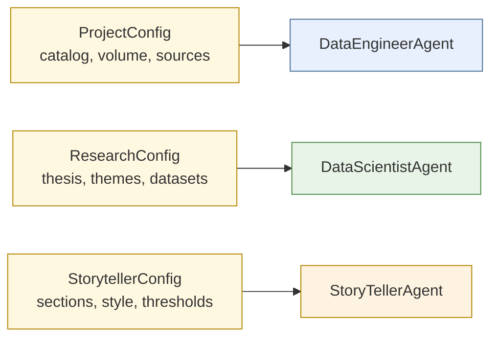

| Config | Controls | Key Fields |
|--------|----------|------------|
| `ProjectConfig` | What data to ingest and how | `catalog`, `schema`, `volume_path`, `join_key`, `known_sources`, `source_processing_hints`, `column_naming_examples`, `grain_detection_guidance` |
| `ResearchConfig` | What questions to investigate | `thesis`, `analysis_themes`, `silver_datasets`, `research_references`, `agent_role`, `domain_context`, `analysis_method_guidance`, `visualization_guidance` |
| `StorytellerConfig` | How to write the report | `narrative_sections`, `style_guide`, `evidence_thresholds`, `output_format`, `domain_writing_rules`, `citation_source_guidance` |

To start a new project, copy an example config, change the domain-specific fields, and run the same agents. See the [Tutorial](tutorial-world-development.md) for a complete walkthrough, or browse the [`examples/`](https://github.com/jweinberg-a2a/versifai-data-agents/tree/main/examples){target="_blank"} directory on GitHub.

---

## LLM Client

The `LLMClient` wraps [LiteLLM](https://docs.litellm.ai/) for multi-provider support:

```python
from versifai.core.llm import LLMClient

# Any LiteLLM-supported provider
llm = LLMClient(model="claude-sonnet-4-6")      # Anthropic
llm = LLMClient(model="gpt-4o")                  # OpenAI
llm = LLMClient(model="azure/gpt-4o")            # Azure
llm = LLMClient(model="gemini/gemini-1.5-pro")   # Google
```

Key features:

- **Prompt caching** -system prompt and tool definitions use `cache_control` to avoid re-billing static tokens each turn
- **Retry logic** -exponential backoff on rate limits, connection errors, 5xx errors
- **Usage tracking** -input/output/cache-read/cache-creation token counts per call

---

## Databricks Integration

### Unity Catalog

All tables live in a three-level namespace: `catalog.schema.table`.

```
my_catalog.world_development.silver_gdp_per_capita
│          │              │
│          │              └── Table name (silver_ prefix = processed)
│          └── Schema (one per project)
└── Catalog (org-level grouping)
```

### Volumes (FUSE Mount)

Raw data files are accessed via Databricks Volumes at `/Volumes/catalog/schema/volume/`.

!!! warning "No file append on FUSE"
    Databricks FUSE mounts don't support file append mode. Versifai uses a read-then-write pattern everywhere:
    ```python
    existing = path.read_text() if path.exists() else ""
    path.write_text(existing + new_content)
    ```

### SQL Execution

Tools that run SQL follow a two-tier pattern:

1. **Try Spark first** -faster, native in Databricks notebooks
2. **Fall back to Databricks SDK** -works outside notebooks, uses async polling

---

## Safety Limits

| Limit | Value | Purpose |
|-------|-------|---------|
| Max agent turns (global) | 200 | Prevent infinite loops |
| Max turns per source | 120 | Allow batch processing of large file sets |
| Max acceptance iterations | 3 | Engineer-analyst feedback cycles |
| Max consecutive tool errors | 5 | Trigger error escalation |
| Memory summarization trigger | 30 messages | Keep context window manageable |
| Auto-flush threshold | 30M rows | Prevent OOM during staging |
| Direct write threshold | 2M rows | Above this, route through parquet |
| LLM retry attempts | 3 | Exponential backoff for API resilience |
