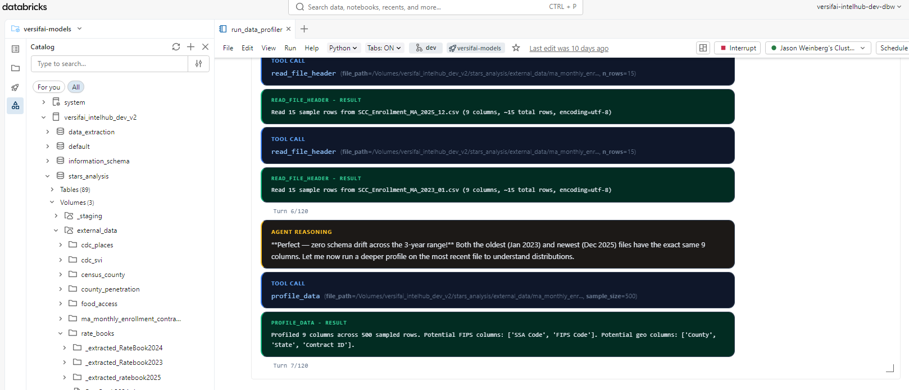

# Getting Started

## Installation

### From PyPI

```bash
# Install with all runtime dependencies
pip install versifai

# With development tools (ruff, mypy, pytest, pre-commit)
pip install "versifai[dev]"
```

### From Source (development)

```bash
git clone https://github.com/jweinberg-a2a/versifai-data-agents.git
cd versifai-data-agents
python -m venv .venv
source .venv/bin/activate
pip install -e ".[dev]"
```

## Set Your LLM API Key

```bash
# Anthropic (default)
export ANTHROPIC_API_KEY="sk-ant-..."

# Or OpenAI
export OPENAI_API_KEY="sk-..."
```

## Quick Start

### 1. Run a Data Engineering Agent

Agents run inside **Databricks notebooks**. You write a config, create the agent, and call `.run()` -the agent handles the rest through its ReAct loop:

```python
from versifai.data_agents import DataEngineerAgent, ProjectConfig

cfg = ProjectConfig(
    name="Sales Pipeline",
    catalog="analytics",
    schema="sales",
    volume_path="/Volumes/analytics/sales/raw_data",
)

agent = DataEngineerAgent(cfg=cfg, dbutils=dbutils)
result = agent.run()
print(f"Processed {result['sources_completed']} sources")
```

Here's what this looks like running in a Databricks notebook -the agent autonomously profiles files, reasons about schema drift, and calls tools to load data into Unity Catalog:



### 2. Run a Data Science Agent

```python
from versifai.science_agents import DataScientistAgent, ResearchConfig

cfg = ResearchConfig(
    name="Customer Churn Analysis",
    catalog="analytics",
    schema="churn",
    results_path="/tmp/results/churn",
    themes=[...],  # Define research themes
)

agent = DataScientistAgent(cfg=cfg, dbutils=dbutils)
result = agent.run()
```

### 3. Generate a Narrative Report

```python
from versifai.story_agents import StoryTellerAgent, StorytellerConfig

cfg = StorytellerConfig(
    name="Churn Analysis Report",
    thesis="Customer churn is driven primarily by...",
    research_results_path="/tmp/results/churn",
    narrative_output_path="/tmp/narrative/churn",
    narrative_sections=[...],  # Define report sections
)

agent = StoryTellerAgent(cfg=cfg, dbutils=dbutils)
result = agent.run()
print(f"Wrote {result['sections_written']} sections")
```

## Multi-Provider LLM Support

Versifai uses [LiteLLM](https://docs.litellm.ai/) under the hood. Switch providers with a single parameter:

```python
from versifai.core import LLMClient

# Anthropic Claude (default)
llm = LLMClient(model="claude-sonnet-4-6")

# OpenAI GPT-4o
llm = LLMClient(model="gpt-4o")

# Azure OpenAI
llm = LLMClient(
    model="azure/gpt-4o",
    api_base="https://my-endpoint.openai.azure.com",
)

# Google Gemini
llm = LLMClient(model="gemini/gemini-1.5-pro")

# Pass the LLM to any agent
agent = DataEngineerAgent(cfg=cfg, dbutils=dbutils)
agent._llm = llm  # Override the default
```

## Smart Resume

All agents support resuming from interruption:

```python
# First run -gets interrupted at source 3 of 10
agent = DataEngineerAgent(cfg=cfg, dbutils=dbutils)
agent.run()  # Ctrl+C after source 3

# Re-run -automatically picks up from source 4
agent = DataEngineerAgent(cfg=cfg, dbutils=dbutils)
agent.run()  # Skips sources 1-3, continues from 4
```

## Running Specific Sections

Both science and story agents support targeted re-runs:

```python
# Re-run only themes 0 and 3
scientist = DataScientistAgent(cfg=cfg, dbutils=dbutils)
scientist.run_themes(themes=[0, 3])

# Re-run only sections 1 and 2 of the narrative
storyteller = StoryTellerAgent(cfg=cfg, dbutils=dbutils)
storyteller.run_sections(sections=[1, 2])
```

## Editorial Review (Human-in-the-Loop)

The storyteller agent has a dedicated editor mode:

```python
agent = StoryTellerAgent(cfg=cfg, dbutils=dbutils)

# Guided review
agent.run_editor(
    instructions="Simplify the methodology section for a policymaker audience."
)

# Open-ended review
agent.run_editor()
```

## Complete Workflow Example

```python
from versifai.data_agents import DataEngineerAgent
from versifai.science_agents import DataScientistAgent
from versifai.story_agents import StoryTellerAgent

# Step 1: Engineer ingests raw data
engineer = DataEngineerAgent(cfg=engineer_cfg, dbutils=dbutils)
engineer.run()

# Step 2: Scientist analyzes the data
scientist = DataScientistAgent(cfg=science_cfg, dbutils=dbutils)
scientist.run()

# Step 3: Storyteller writes the report
storyteller = StoryTellerAgent(cfg=story_cfg, dbutils=dbutils)
storyteller.run()
```

For a complete, runnable example using real World Bank data, see the
[World Development Tutorial](tutorial-world-development.md) or browse the source in
[`examples/world_development/`](https://github.com/jweinberg-a2a/versifai-data-agents/tree/main/examples/world_development){target="_blank"}.

## Configuration

### CatalogConfig (shared)

All agents that interact with Databricks Unity Catalog use `CatalogConfig`:

```python
from versifai.core import CatalogConfig

catalog = CatalogConfig(
    catalog="my_catalog",
    schema="my_schema",
    volume_path="/Volumes/my_catalog/my_schema/data",
    staging_path="/Volumes/my_catalog/my_schema/staging",
)
```

### AgentSettings (shared)

Tune agent behavior globally:

```python
from versifai.core import AgentSettings

settings = AgentSettings(
    max_agent_turns=200,        # Max ReAct iterations per run
    max_turns_per_source=120,   # Max turns per data source
    max_acceptance_iterations=3, # Validation retry limit
    sample_rows=10,             # Rows shown in profiling previews
)
```

### Environment Variables

| Variable | Purpose | Required |
|---|---|---|
| `ANTHROPIC_API_KEY` | Anthropic Claude API key | If using Claude |
| `OPENAI_API_KEY` | OpenAI API key | If using GPT models |
| `DATABRICKS_HOST` | Databricks workspace URL | For catalog operations |
| `DATABRICKS_TOKEN` | Databricks PAT | For catalog operations |
