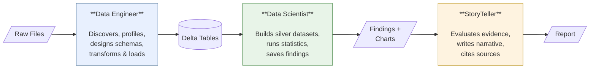

  

If the work of data science is going to be automated, it should be done in open source -by the people who have a passion for data and genuinely love the craft. As we reinvent this profession, we should hold certain principles at our core: reproducibility, transparency, and respect for the rigor that makes data science trustworthy. That is why I created Versifai, and why it will remain open source at its heart.

— Jason Weinberg, Creator

**Open-source AI agents for autonomous data engineering, science, and storytelling.**

Versifai provides specialized AI agents that automate the complete data lifecycle -from raw file discovery and schema design, through statistical analysis and modeling, to compelling narrative reports with citations and evidence.

---

## Design Philosophy

### Reproducibility First

Everything is reproducible if you remove the AI agent from the process.

The agent produces artifacts -SQL queries, statistical tests, charts, findings -**alongside** its results. Every claim in a report traces back to a finding, which traces back to a statistical test, which traces back to a SQL query, which traces back to raw data. A human can follow the chain end-to-end without the AI.

[Learn more about artifacts and reproducibility](run-management.md){ .md-button }

### Validation at Every Checkpoint

Agents don't just produce output -they validate it. The Data Analyst agent reviews every table the engineer creates, checking join key integrity, null rates, value ranges, and cross-table joinability. The Data Scientist validates silver datasets before analysis and validates statistical rigor (multiple comparisons, multicollinearity, ecological fallacy) before saving findings. The StoryTeller evaluates evidence strength before citing it -weak evidence can't be presented as a lead finding.

### Human-in-the-Loop When It Matters

Every agent has access to `ask_human` -a tool that pauses execution and asks the operator a question. When the agent encounters genuine ambiguity (e.g., "this column could be a ZIP code or a product ID -which is it?"), it asks rather than guesses. The StoryTeller has a dedicated editorial review mode where a human can give rewrite instructions after the first draft.

### Guardrails on Assumptions

Agents operate within explicit boundaries:

- **SQL write protection** -The Data Scientist and StoryTeller can only write to `silver_*` tables. They cannot modify the engineer's source tables.
- **Evidence tiers** -Statistical claims are classified by strength (DEFINITIVE, STRONG, SUGGESTIVE, CONTEXTUAL, WEAK). Narrative text must match the statistical evidence -if p=0.73, the finding is WEAK regardless of what the text says.
- **Dynamic tool security** -When agents create custom tools at runtime, blocked operations include shell commands, file I/O, network access, and direct Spark access.
- **Safety limits** -Maximum turns per phase, maximum consecutive errors, and automatic memory compression prevent runaway execution.

### Don't Reinvent the Wheel

Versifai is built **on top of Databricks** as the data platform. We don't build storage engines (Delta Lake does that), SQL engines (Spark does that), or auth (Databricks SDK does that). We leverage established open-source libraries -`litellm` for LLM access, `scipy` and `scikit-learn` for statistics, `matplotlib` and `plotly` for visualization. Our value is the **agent orchestration, tool design, and domain logic**.

### Smart Resume by Default

Agents persist state to disk and resume from where they left off. If a notebook crashes after processing 4 of 7 research themes, re-running picks up at theme 5 with full knowledge of what was already done. Each section, finding, and table is a durable checkpoint -written to disk the moment it's complete.

[Learn more about smart resume](run-management.md#smart-resume){ .md-button }

---

## The Three Agents

| Agent | What It Does | Key Tools |
|-------|-------------|-----------|
| **Data Engineer** | Ingests raw files, profiles them, designs schemas, transforms and loads into Delta tables | `explore_volume`, `profile_data`, `design_schema`, `transform_and_load`, `write_to_catalog` |
| **Data Scientist** | Builds analytical datasets, runs statistical analysis, fits models, saves structured findings | `statistical_analysis`, `fit_model`, `check_confounders`, `save_finding`, `create_visualization` |
| **StoryTeller** | Reads findings, evaluates evidence strength, writes narrative report with citations | `read_findings`, `evaluate_evidence`, `write_narrative`, `cite_source` |

Each agent is **config-driven** -all domain knowledge lives in a Python dataclass. The agent code is generic and reusable across projects. To start a new project, you write new configs and run the same agents.

---

## See It In Action

Read a full research report produced end-to-end by Versifai's agent pipeline -from raw CMS data ingestion through statistical analysis to narrative output:

[CMS Stars Adjustment: An Autonomous Policy Research Report](https://www.versifai.org/blog/stars-adjustment-policy-research){ .md-button .md-button--primary target="_blank" }

---

## Key Features

- **Multi-provider LLM** -Swap between Claude, GPT-4, Azure, Gemini, or any [LiteLLM](https://docs.litellm.ai/)-supported provider with a single parameter
- **Modular tool system** -40+ tools with a shared registry. Add your own in minutes by subclassing `BaseTool`
- **Run isolation** -Each execution gets its own timestamped directory with metadata, artifacts, and state
- **Databricks native** -First-class support for Unity Catalog, Delta tables, and Volumes
- **Tool-based architecture** -All agent work happens through auditable, testable, composable tools. No business logic in prompts.

---

[Get Started](getting-started.md){ .md-button .md-button--primary }
[Tutorial: World Development](tutorial-world-development.md){ .md-button }
[Architecture](architecture.md){ .md-button }
[Examples](https://github.com/jweinberg-a2a/versifai-data-agents/tree/main/examples){ .md-button target="_blank" }
[View on GitHub](https://github.com/jweinberg-a2a/versifai-data-agents){ .md-button target="_blank" }

