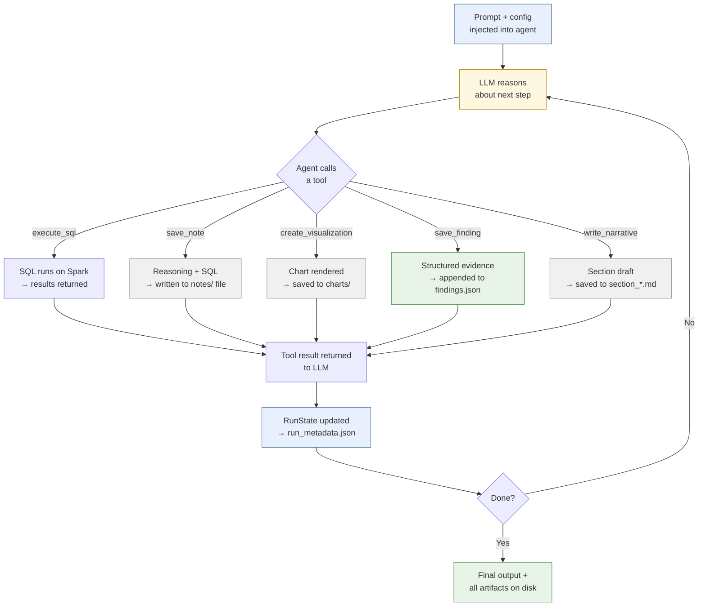
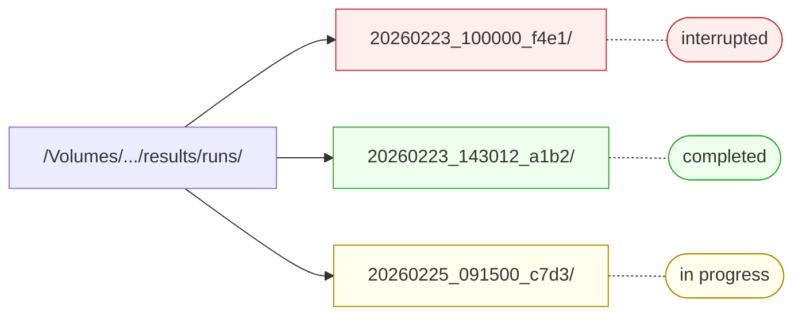
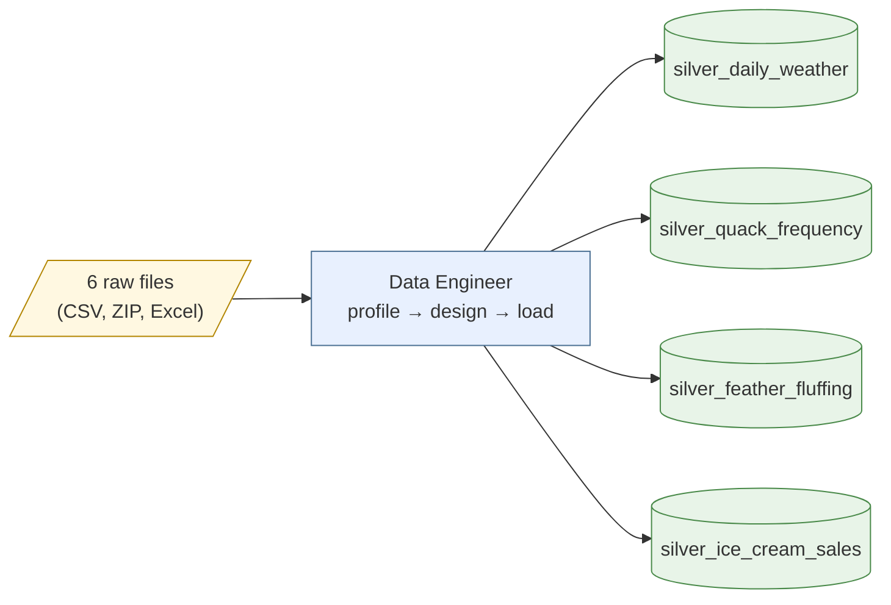
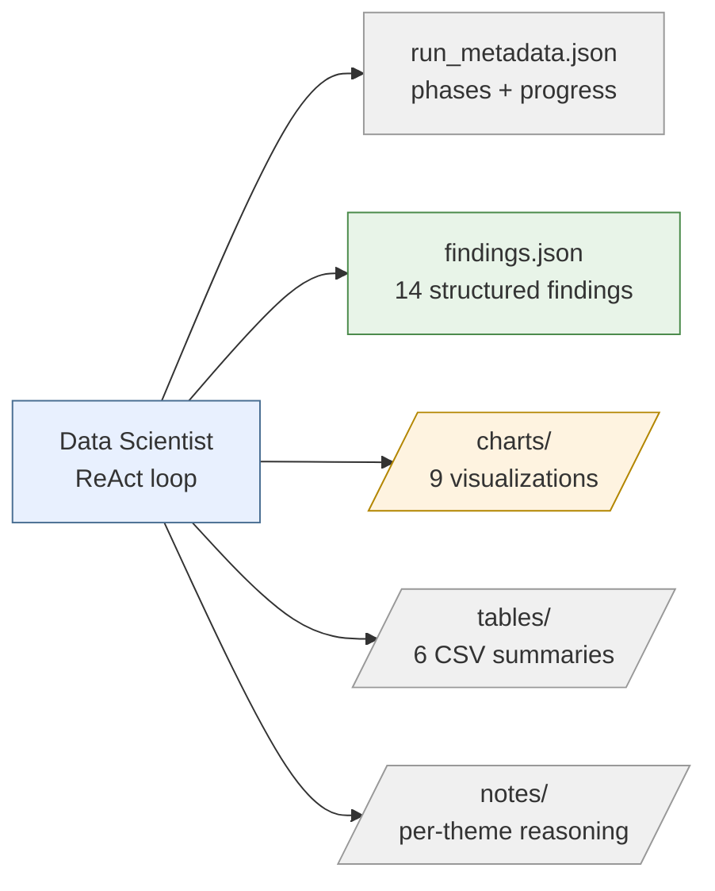
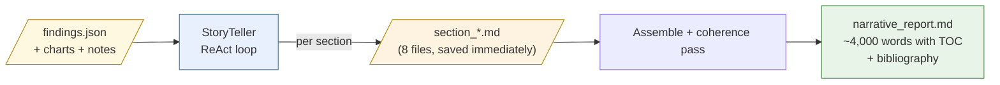
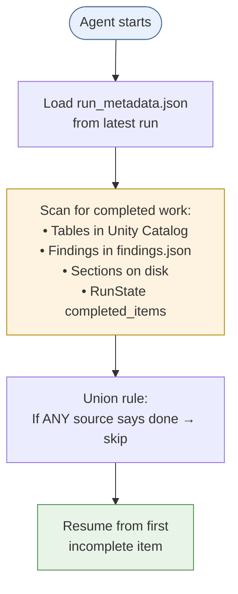
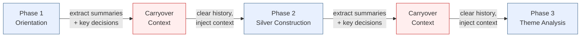
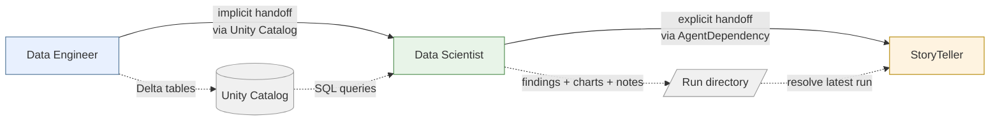
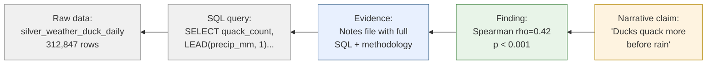

# Run Management & Reproducibility

Versifai agents don't just produce answers — they produce **auditable artifacts
that show their work**. Every SQL query, every statistical test, every chart,
every decision is recorded to disk. If you remove the AI agent from the process,
a human can follow the exact same reasoning path and verify every conclusion.

This page explains **what agents output**, **how runs are isolated and resumed**,
and **how knowledge flows between agents**.

---

## The Core Idea

Most AI systems work like this: **Input → LLM → Answer.** The answer is the
only output. If something goes wrong, you start over.

Versifai agents run in a **ReAct loop** — a cycle of reasoning and tool calls.
At each step in the loop, the agent produces durable artifacts on disk. The
answer is one output among many:



Every cycle through the loop leaves something on disk. If the agent crashes
at any point, the artifacts from completed cycles are already persisted —
and the agent can resume from where it left off.

**Why this matters:**

- **Reproducibility** — A human can re-run any SQL query, re-generate any chart,
  and verify any statistical claim without the LLM
- **Resumability** — If the agent crashes at theme 4 of 7, it restarts at theme 5
  with full knowledge of what was already done
- **Auditability** — Every decision has a timestamp, every chart has its source
  data, every finding has its p-value and methodology
- **Inter-agent handoff** — The StoryTeller reads the Scientist's structured
  outputs, not raw LLM text

---

## Run Isolation

Every agent execution gets its own **run directory** — a timestamped folder
that contains all outputs for that run. This means you can run the same agent
multiple times without overwriting previous results.

### Run ID Format

```
20260223_143012_a1b2
│        │       │
│        │       └── Random suffix (4 hex chars)
│        └── Time: 14:30:12
└── Date: 2026-02-23
```

Run IDs are **lexicographically sortable** — alphabetical order = chronological
order. This makes "find the latest run" trivial.

### Directory Structure



Each run directory is self-contained:

```
runs/20260223_143012_a1b2/
├── run_metadata.json          # Run state, timing, completion status
├── findings.json              # Structured research findings (Scientist)
├── narrative_report.md        # Final assembled report (StoryTeller)
├── section_intro.md           # Individual narrative sections (StoryTeller)
├── section_analysis.md
├── charts/                    # Visualization outputs
│   ├── theme0_distribution.png
│   ├── theme1_scatter.png
│   └── theme5_precision_recall.png
├── tables/                    # CSV result tables
│   ├── correlation_matrix.csv
│   └── model_comparison.csv
└── notes/                     # Per-theme reasoning logs
    ├── theme_0_notes.txt
    ├── theme_1_notes.txt
    └── silver_notes.txt
```

---

## What Each Agent Outputs

### Data Engineer

The Data Engineer's outputs are **Delta tables in Unity Catalog** — not files on
disk. It creates clean, validated, joinable tables from raw data files.



Every table includes:

| Column | Purpose |
|--------|---------|
| `source_file_name` | Which raw file this row came from (audit trail) |
| `load_timestamp` | When this row was loaded (reproducibility) |
| Join key (e.g., `station_id`) | Links this table to every other table |

The `source_file_name` column is what enables **smart resume** — on re-run, the
agent queries the table to see which files are already loaded and skips them.

### Data Scientist

The Data Scientist produces the richest set of artifacts:



#### findings.json — Structured Evidence

Every statistical finding the agent discovers is saved as a structured record.
This is the primary handoff artifact to the StoryTeller.

```json
[
  {
    "research_question_id": "theme_1",
    "title": "Quack-Rain Correlation Confirmed",
    "finding": "Quack frequency at lag-1 shows Spearman rho=0.42 with next-day precipitation.",
    "evidence": "Spearman rank correlation: rho=0.42, p<0.001, n=312,847. Effect persists across all seasons (summer rho=0.51, winter rho=0.28). Partial correlation controlling for temperature: rho=0.38, p<0.001.",
    "significance": "high",
    "visualization_path": "charts/theme1_lag_correlation.png",
    "timestamp": "2026-02-23T14:35:22.123456",
    "index": 3
  }
]
```

| Field | Purpose |
|-------|---------|
| `research_question_id` | Links finding to the research theme that produced it |
| `title` | One-line summary for the StoryTeller to reference |
| `finding` | The actual discovery in plain language |
| `evidence` | Statistical backing — p-values, effect sizes, sample sizes, methods |
| `significance` | `high` / `medium` / `low` — drives evidence tier classification |
| `visualization_path` | Chart that supports this finding |

#### Notes — The Reasoning Log

Per-theme notes files are the most important artifact for reproducibility.
They record **everything the agent did and why** — every SQL query, every
statistical test, every decision.

```markdown
--- 2026-02-23 14:25:33 ---
Starting Theme 1: Quack Before the Storm.
Research question: Is there a significant correlation between quack
frequency and next-day rain?

Required table: silver_weather_duck_daily
Available columns: station_id, observation_date, quack_count,
  temp_max_c, temp_min_c, precip_mm, fluff_intensity

--- 2026-02-23 14:27:15 ---
Step 1: Computing lag-1 correlation.

SQL used:
  SELECT station_id, observation_date, quack_count,
    LEAD(precip_mm, 1) OVER (
      PARTITION BY station_id ORDER BY observation_date
    ) AS next_day_precip
  FROM silver_weather_duck_daily
  WHERE quack_count IS NOT NULL

Result: 312,847 rows with complete lag-1 pairs.

--- 2026-02-23 14:28:40 ---
Spearman correlation: rho = 0.42, p < 0.001
Pearson correlation: r = 0.35, p < 0.001
(Spearman higher → relationship is monotonic but not strictly linear)

--- 2026-02-23 14:30:12 | CHART: theme1_lag_correlation.png ---
Type: line
Title: Lag-Correlation: Quack Frequency vs. Precipitation
Path: /Volumes/.../charts/theme1_lag_correlation.png

SQL Query:
  SELECT lag_days, season,
    CORR(quack_count, precip_at_lag) AS correlation
  FROM lagged_quack_precip
  GROUP BY lag_days, season

Interpretation: The lag-1 peak is consistent across all seasons.
Summer shows the strongest signal (r=0.51), winter the weakest (r=0.28).

--- 2026-02-23 14:32:55 ---
Step 3: Checking for temperature confound.
Partial correlation controlling for temp_max_c: rho = 0.38, p < 0.001.
Temperature explains some variance but the quack signal persists.
```

!!! tip "Why notes matter"
    If you read a notes file top to bottom, you get a complete lab notebook
    of everything the agent did for that theme. Every SQL query is there.
    Every statistical result is there. You can re-run any of it manually
    without the AI.

#### Chart Metadata

Every chart saved to `charts/` also has its metadata logged to the notes file.
This includes the SQL query that produced the data, the render code, and a
sample of the input data. A human can regenerate any chart from its metadata.

### StoryTeller

The StoryTeller produces narrative sections and a final assembled report:



Each section is **persisted to disk immediately** after the agent writes it.
If the agent crashes after writing 5 of 8 sections, those 5 sections are
already on disk and will be loaded on resume.

---

## Smart Resume

The most practical feature of the run management system: **agents detect what's
already been done and skip it.**

### How It Works



### Data Scientist Resume

The scientist checks **three sources** to determine what's complete:

| Source | What It Checks | Example |
|--------|---------------|---------|
| **Unity Catalog** | Do the silver tables exist? | `silver_weather_duck_daily` in catalog → silver phase done |
| **findings.json** | Which themes have findings? | Finding with `research_question_id: "theme_1"` → theme 1 done |
| **RunState** | What did the run state record? | `completed_items.themes: ["theme_0", "theme_1"]` |

The system uses a **union rule** — if any of these three sources says a piece
of work is done, it's treated as done.

```python
# Pseudocode from _scan_pipeline_state()
completed_silver = set()

# Check 1: Does the table exist in the catalog?
for dataset in config.silver_datasets:
    if dataset.name in catalog_tables:
        completed_silver.add(dataset.name)

# Check 2: Does the run state say it's done?
for name in run_state.completed_items.get("silver", []):
    completed_silver.add(name)

# Union: skip anything in completed_silver
```

### StoryTeller Resume

The storyteller checks for **section files on disk**:

```python
# Scan the output directory for existing sections
for filename in os.listdir(output_path):
    if filename.startswith("section_") and filename.endswith(".md"):
        # This section exists — skip it on resume
        completed[section_id] = content
```

This is why sections are persisted immediately — each one is a durable
checkpoint.

### What Resume Looks Like

```
$ python run_scientist.py

Phase 1: Orientation — SKIPPED (already completed)
Phase 2: Silver Construction
  ├── silver_weather_duck_daily — SKIPPED (exists in catalog)
  ├── silver_duck_forecast_comparison — SKIPPED (exists in catalog)
  └── silver_ice_cream_weather — RUNNING...
Phase 3: Theme Analysis
  ├── Theme 0: The Quack Census — SKIPPED (findings exist)
  ├── Theme 1: Quack Before the Storm — SKIPPED (findings exist)
  ├── Theme 2: The Fluff Factor — SKIPPED (findings exist)
  ├── Theme 3: The Ice Cream Confounder — SKIPPED (findings exist)
  ├── Theme 4: V-Formation Tornado Warning — RUNNING...  ← picks up here
  ...
```

---

## Run State Tracking

The `RunState` dataclass tracks exactly where the agent is in its pipeline.
It's persisted to `run_metadata.json` and updated after every completed item.

```json
{
  "run_id": "20260223_143012_a1b2",
  "agent_type": "scientist",
  "config_name": "duck_rain_prediction",
  "started_at": "2026-02-23T14:00:00",
  "state": {
    "status": "running",
    "entry_point": "run",
    "current_phase": "theme_analysis",
    "current_item": "theme_4",
    "completed_phases": ["orientation", "silver"],
    "completed_items": {
      "silver": ["silver_weather_duck_daily", "silver_duck_forecast_comparison", "silver_ice_cream_weather"],
      "themes": ["theme_0", "theme_1", "theme_2", "theme_3"]
    },
    "updated_at": "2026-02-23T15:12:33"
  }
}
```

| Field | Purpose |
|-------|---------|
| `status` | `running` / `completed` / `failed` / `interrupted` |
| `current_phase` | What the agent is working on right now |
| `current_item` | The specific item within the phase |
| `completed_phases` | Phases that are fully done |
| `completed_items` | Per-phase list of completed items (for partial progress) |

---

## Carryover Context

When an agent moves between phases, its conversation history is cleared to
save tokens — but **key knowledge is preserved** via carryover context.



The `AgentMemory` class manages this:

- **`reset_for_new_source()`** — Clears conversation history but preserves
  source summaries, context notes, and decisions
- **`get_carryover_context()`** — Builds a markdown summary of everything
  learned so far (last 10 notes, all source summaries)
- **`log_source_summary()`** — Records a one-line summary of what was done
  for a source/phase

This means the agent in phase 3 knows what happened in phases 1 and 2 —
without carrying 200 messages of conversation history.

---

## Inter-Agent Handoff

The three agents don't communicate directly. They communicate through
**structured artifacts on disk.**



### Engineer → Scientist

The handoff is **implicit** — both agents point to the same Unity Catalog
schema. The scientist runs `list_catalog_tables` and sees the tables the
engineer created.

### Scientist → StoryTeller

The handoff is **explicit** via `AgentDependency`:

```python
from versifai.core.run_manager import AgentDependency

# StoryTeller config declares where to find scientist outputs
dependency = AgentDependency(
    agent_type="scientist",
    config_name="duck_rain_prediction",
    base_path="/Volumes/.../results",
    run_id=""  # Empty = use latest run
)
```

The dependency resolver finds the latest scientist run and returns its path.
The StoryTeller then reads `findings.json`, scans `charts/`, `tables/`, and
`notes/` from that directory.

---

## The Reproducibility Contract

Every artifact the system produces can be verified by a human without the LLM:

| Artifact | How to Verify |
|----------|--------------|
| **Delta table** | Run the CREATE TABLE SQL from the schema designer's output |
| **Statistical finding** | Re-run the SQL query from the notes file, feed results to scipy/statsmodels |
| **Chart** | Re-run the SQL query + render code from the notes file |
| **Narrative claim** | Check the finding it cites → check the evidence → check the SQL |
| **Evidence tier** | Compare the p-value and effect size against the tier criteria |

The chain is always: **Narrative claim → Finding → Evidence → SQL query → Raw data.**

Every link in that chain is recorded as an artifact on disk.



This is the core design principle: **the AI is there to create artifacts, not
to be the artifact.** Remove the AI and the work still stands.
