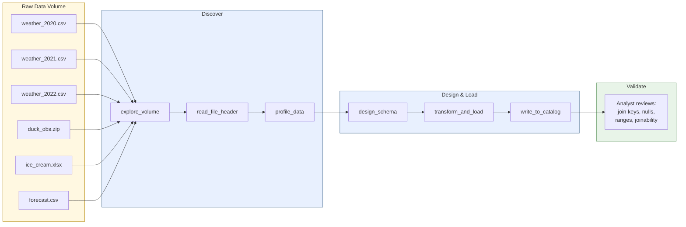
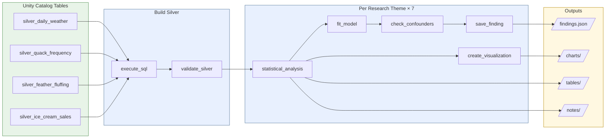
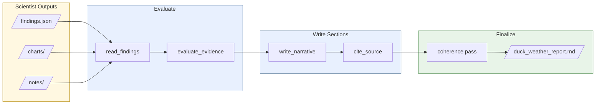
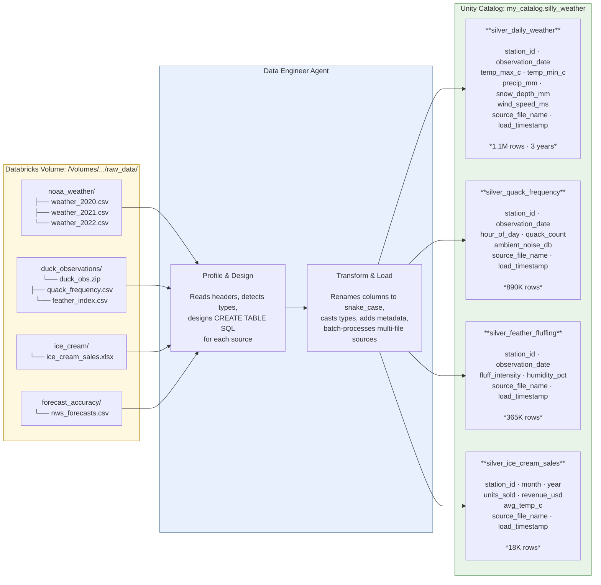
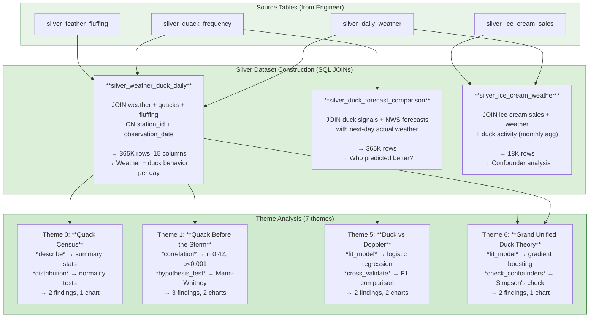

# Tutorial: Silly Weather Example

This walkthrough builds a complete Versifai project from scratch using the
**Silly Weather** example — a tongue-in-cheek investigation into whether duck
behavior can predict rain better than professional meteorologists.

The topic is intentionally absurd, but the framework patterns are exactly what
you'd use for a real analysis. By the end, you'll understand how to:

1. Write a **ProjectConfig** for the Data Engineer
2. Write a **ResearchConfig** for the Data Scientist
3. Write a **StorytellerConfig** for the StoryTeller
4. Wire everything together in **Databricks notebook entrypoints**

All example files live in
[`examples/silly_weather/`](https://github.com/jweinberg-a2a/versifai-data-agents/tree/main/examples/silly_weather).

---

## What You're About to Build

Three agents run in sequence — each one picks up where the last one left off.

### Stage 1: Data Engineer — Raw Files to Delta Tables

The engineer discovers files in a Databricks Volume, profiles each one, then
designs schemas and loads them into Unity Catalog.



**Result:** 4 clean Delta tables in Unity Catalog — `silver_daily_weather`,
`silver_quack_frequency`, `silver_feather_fluffing`, `silver_ice_cream_sales`.

### Stage 2: Data Scientist — Tables to Findings

The scientist joins engineer tables into analytical datasets, then runs
7 research themes — each producing statistical tests, charts, and findings.



**Result:** 14 structured findings, 9 charts, 6 CSV summaries, and per-theme
reasoning notes — all persisted to the run directory.

### Stage 3: StoryTeller — Findings to Report

The storyteller reads the scientist's outputs, evaluates evidence strength,
writes narrative sections, and assembles the final report.



**Result:** A ~4,000-word narrative report with table of contents, inline
citations, and a bibliography — ready for editorial review.

---

### How It All Connects

| Part | What It Is | What Changes Between Projects |
|------|-----------|-------------------------------|
| **Config** | A Python dataclass holding all domain knowledge | Everything — this is where your project lives |
| **Agent** | A generic Python class that reads the config and does work | Nothing — agents are reusable across projects |
| **Notebook** | A Databricks notebook that creates the agent and runs it | Just the import path to your config |

The agents are generic. All the domain-specific knowledge lives in the configs.
This means you never modify agent code — you just write new configs.

For a deeper look at the ReAct loop, tool system, and agent internals, see the
[Architecture](architecture.md) page.

---

## Step 1: The Engineer Config

**File:** `examples/silly_weather/engineer_config.py`

The `ProjectConfig` tells the Data Engineer Agent everything it needs to ingest
raw data files from a Databricks Volume into Delta tables.

### The Essentials

```python
from versifai.data_agents.engineer.config import ProjectConfig, JoinKeyConfig

SILLY_WEATHER = ProjectConfig(
    name="Silly Weather: Do Ducks Predict Rain Better Than Meteorologists?",
    catalog="my_catalog",       # Your Unity Catalog name
    schema="silly_weather",     # Schema where tables will be created
    volume_path="/Volumes/my_catalog/silly_weather/raw_data",  # Where CSVs live
)
```

These four fields are the minimum. The agent will scan the Volume, profile
files, and figure out what to do. But you can help it work faster and smarter
by adding hints.

### Join Key — How Tables Connect

The `join_key` defines the primary column used to join all tables together.
Every table the engineer creates should include this column:

```python
from versifai.data_agents.engineer.config import JoinKeyConfig

join_key = JoinKeyConfig(
    column_name="station_id",
    data_type="STRING",
    description="NOAA weather station identifier.",
    validation_rule="Must match pattern 'USW\\d{8}' or 'USC\\d{8}'",
    expected_entity_count=500,
    related_columns=[
        {"name": "state_code", "description": "Two-letter US state code", "required": True},
        {"name": "latitude", "description": "Decimal degrees", "required": False},
    ],
)
```

!!! tip "Why declare a join key?"
    The agent uses this to validate that loaded tables can actually be joined.
    If a table is missing the join key column, the agent flags it during
    quality checks.

### Known Sources — Help the Agent Recognize Files

If you know what files are in your Volume, tell the agent:

```python
from versifai.data_agents.engineer.config import DataSourceHint

known_sources = [
    DataSourceHint(
        name="NOAA Daily Weather Summaries",
        description="Daily temp, precip, snow, wind for US stations.",
        keywords=["GHCND", "daily_summary", "NOAA"],
    ),
    DataSourceHint(
        name="Duck Pond Observation Logs",
        description="Daily quack frequency, feather-fluffing intensity.",
        keywords=["duck", "pond", "quack"],
    ),
]
```

These are just hints — the agent will still explore and profile everything.
But hints help it match files to sources faster.

### Source Processing Hints — Multi-File Instructions

For data sources that contain multiple files (like a ZIP with several CSVs),
use `SourceProcessingHint` to tell the agent exactly what to do:

```python
from versifai.data_agents.engineer.config import SourceProcessingHint, SourceFileHint

source_processing_hints = [
    SourceProcessingHint(
        source_pattern="duck_observations",
        description="Duck pond observation logs",
        multi_table=True,    # Create SEPARATE tables for each file type
        files=[
            SourceFileHint(
                file_pattern="quack_frequency",
                target_table="silver_quack_frequency",
                description="Daily quack counts per pond per hour",
            ),
            SourceFileHint(
                file_pattern="feather_index",
                target_table="silver_feather_fluffing",
                description="Daily feather fluffing intensity (0-10)",
            ),
        ],
    ),
]
```

!!! note "multi_table=True"
    When `multi_table=True`, the agent creates a separate Delta table for each
    file type. When `False` (default), all files in the source are combined
    into a single table.

### Metadata Columns — Added to Every Table

Define columns that should appear in every table automatically:

```python
from versifai.data_agents.engineer.config import MetadataColumnConfig

metadata_columns = [
    MetadataColumnConfig(
        name="source_file_name", data_type="STRING",
        description="Original filename the row was loaded from",
    ),
    MetadataColumnConfig(
        name="source_year", data_type="INT",
        description="The observation year extracted from the data",
    ),
    MetadataColumnConfig(
        name="load_timestamp", data_type="TIMESTAMP",
        description="When this row was loaded into the catalog",
    ),
]
```

### Putting It All Together

See the complete config in
[`engineer_config.py`](https://github.com/jweinberg-a2a/versifai-data-agents/blob/main/examples/silly_weather/engineer_config.py).

---

## Step 2: The Research Config

**File:** `examples/silly_weather/research_configs/duck_rain_prediction.py`

The `ResearchConfig` tells the Data Scientist Agent what to investigate. It
defines your thesis, analysis themes, silver datasets, and references.

### The Thesis

Every research config starts with a thesis — the core argument to investigate:

```python
from versifai.science_agents.scientist.config import ResearchConfig

DUCK_RAIN = ResearchConfig(
    name="Do Ducks Predict Rain Better Than Meteorologists?",
    thesis=(
        "Duck behavioral signals (quack frequency, feather-fluffing intensity, "
        "and V-formation flight patterns) contain genuine meteorological "
        "information that provides statistically significant 24-hour "
        "precipitation forecasts."
    ),
)
```

The thesis drives the entire analysis. Every theme either supports, refutes,
or adds nuance to this claim.

### Analysis Themes — The Research Arc

Themes are the heart of the config. Each theme is one unit of analysis with
a specific research question, methodology, and expected outputs:

```python
from versifai.science_agents.scientist.config import AnalysisTheme

theme_1 = AnalysisTheme(
    id="theme_1",
    title="Quack Before the Storm",
    question="Is there a significant correlation between quack frequency and next-day rain?",
    analysis_type="correlation",       # descriptive | comparative | correlation | trend
    sequence=1,                        # Execution order
    required_tables=[                  # Tables the agent needs
        "silver_weather_duck_daily",
    ],
    analysis_steps=[                   # Step-by-step methodology
        "Compute Pearson and Spearman correlation: quacks(t) vs precip(t+1)",
        "Run time-lagged cross-correlation for lags 0-3 days",
        "Test significance with permutation test (10,000 shuffles)",
        "Stratify by season",
        "Control for temperature (partial correlation)",
    ],
    tables_to_produce=[                # Expected output tables
        "quack_precip_correlation_matrix",
        "lagged_cross_correlation_results",
        "seasonal_correlation_breakdown",
    ],
    signature_visualization=(          # The ONE key chart for this theme
        "A lag-correlation plot (x=lag days, y=correlation coefficient) "
        "with confidence bands. One line per season."
    ),
    punchline=(                        # One-line summary of expected finding
        "Quack frequency at lag-1 shows r=X.XX with next-day rain (p=X.XXX)."
    ),
    data_notes=(                       # Domain-specific hints for the agent
        "Use silver_weather_duck_daily. Create lag columns. "
        "Rain threshold: precip_mm > 2.54 (0.1 inch)."
    ),
)
```

!!! info "How many themes?"
    Most projects have 5-10 themes. Each theme should answer one focused
    research question. Themes build on each other — early themes establish
    baselines, middle themes test hypotheses, and later themes synthesize.

The Silly Weather example has 7 themes:

| # | Title | Question |
|---|-------|----------|
| 0 | The Quack Census | What does our data look like? |
| 1 | Quack Before the Storm | Do quacks correlate with next-day rain? |
| 2 | The Fluff Factor | Does feather-fluffing predict storm severity? |
| 3 | The Ice Cream Confounder | Is the duck signal just a temperature proxy? |
| 4 | V-Formation Tornado Warning | Do formation flights predict severe weather? |
| 5 | Duck vs Doppler | Who predicts better: ducks or meteorologists? |
| 6 | The Grand Unified Duck Theory | Can we build a combined prediction model? |

### Silver Datasets — Pre-Joined Analytical Tables

Silver datasets are intermediate tables the agent builds by joining multiple
source tables. Declare them upfront so the agent knows what to construct:

```python
from versifai.science_agents.scientist.config import SilverDatasetSpec

silver_weather_duck = SilverDatasetSpec(
    name="silver_weather_duck_daily",
    description="Daily weather joined with duck behavioral metrics.",
    source_tables=["silver_daily_weather", "silver_quack_frequency", "silver_feather_fluffing"],
    join_key="station_id",
    time_column="observation_date",
    data_notes="Join via station_id + observation_date. ~15% NULL duck obs on weekdays.",
)
```

The agent builds these in its "Silver Construction" phase before running
any theme analysis.

### Research References

Point the agent to relevant published work:

```python
from versifai.science_agents.scientist.config import ResearchReference

refs = [
    ResearchReference(
        title="Animal Behavior as Weather Predictors: A Meta-Analysis",
        url="https://en.wikipedia.org/wiki/Weather_lore",
        description="Survey of folklore and scientific evidence",
    ),
]
```

The agent uses these during its literature review tool to compare its
findings against published results.

---

## Step 3: The Storyteller Config

**File:** `examples/silly_weather/storyteller_config.py`

The `StorytellerConfig` tells the StoryTeller Agent how to write the
narrative report from the scientist's findings.

### Style Guide — Voice and Tone

```python
from versifai.story_agents.storyteller.config import StyleGuide

style = StyleGuide(
    voice="third-person with dry humor",
    audience="Data scientists and curious duck enthusiasts",
    document_type="Research white paper (tongue-in-cheek)",
    tone_guidance=(
        "Deadpan scientific. Write as if this were a real Nature paper "
        "that happens to be about ducks."
    ),
    anti_patterns=(
        "- NO: Exclamation marks in scientific claims<br>"
        "- NO: 'Interestingly' or 'Surprisingly'<br>"
        "- NO: Hedging on clearly significant results<br>"
    ),
)
```

### Narrative Sections — The Story Arc

Each section maps to one or more research themes and has specific writing
instructions:

```python
from versifai.story_agents.storyteller.config import NarrativeSection

section_showdown = NarrativeSection(
    id="section_showdown",
    title="Duck vs. Doppler: The Showdown",
    purpose="Head-to-head comparison with professional meteorologists",
    source_theme_ids=["theme_5"],    # Maps to research theme(s)
    tone="analytical",
    max_words=1500,
    key_evidence="Precision-recall curves, F1 scores, McNemar's test",
    narrative_guidance=(
        "This is the climax. Present paired PR curves side by side. "
        "Be ruthlessly honest about where ducks fail."
    ),
    transition_from="The duck signal is real. But can it compete?",
    transition_to="What if we combined forces?",
    sequence=4,
)
```

!!! tip "Transitions"
    The `transition_from` and `transition_to` fields help the agent write
    smooth connective tissue between sections. The coherence pass uses these
    to verify the narrative flows naturally.

### Evidence Thresholds

Control how strong evidence must be before the agent cites it:

```python
from versifai.story_agents.storyteller.config import EvidenceThreshold

evidence = EvidenceThreshold(
    min_significance_for_lead="high",      # Lead findings need p < 0.01
    min_significance_for_support="medium", # Supporting evidence needs p < 0.05
    require_effect_size=True,              # Must report effect sizes
    max_unsupported_claims=0,              # Zero tolerance for ungrounded claims
)
```

### Output Format

```python
from versifai.story_agents.storyteller.config import OutputFormat

output = OutputFormat(
    format="markdown",
    filename="duck_weather_report.md",
    include_toc=True,
    include_methodology_appendix=True,
    include_data_sources_appendix=True,
)
```

---

## Step 4: Notebook Entrypoints

The notebooks are where you actually run the agents. Each notebook follows
the same pattern:

1. Install versifai
2. Load the config
3. Create the agent
4. Run it

### Running the Engineer

**File:** `examples/silly_weather/notebooks/run_engineer.py`

```python
from examples.silly_weather.engineer_config import SILLY_WEATHER
from versifai.data_agents.engineer.agent import DataEngineerAgent

cfg = SILLY_WEATHER
agent = DataEngineerAgent(cfg=cfg, dbutils=dbutils)

# Stage 1: Discover, profile, design schemas, transform & load
results = agent.run(source_path=cfg.volume_path)

# Stage 2: Standardize column names
rename_results = agent.run_rename()

# Stage 3: Build data catalog table
catalog_results = agent.run_catalog()

# Stage 4: Validate all tables
quality_results = agent.run_quality_check()
```

Each stage is a separate method call. If the notebook crashes, re-run it —
the agent has **smart resume** and will skip completed work.

### Running the Scientist

**File:** `examples/silly_weather/notebooks/run_scientist.py`

```python
from examples.silly_weather.research_configs.duck_rain_prediction import DUCK_RAIN
from versifai.science_agents.scientist.agent import DataScientistAgent

cfg = DUCK_RAIN
agent = DataScientistAgent(cfg=cfg, dbutils=dbutils)

# Full pipeline: Orientation → Silver Construction → Analysis → Synthesis
results = agent.run()
```

The scientist runs through 4 phases automatically:

1. **Orientation** — Inventory tables, assess data quality
2. **Silver Construction** — Build the pre-joined analytical datasets
3. **Theme Analysis** — Execute each theme sequentially
4. **Synthesis** — Cross-validate findings, compile summary

You can also run specific themes:

```python
# Skip themes 0-2, run only 3-6
agent.run_themes(start_theme=3)

# Run only specific themes
agent.run_themes(themes=[1, 5])
```

### Running the StoryTeller

**File:** `examples/silly_weather/notebooks/run_storyteller.py`

```python
from examples.silly_weather.storyteller_config import DUCK_STORY
from versifai.story_agents.storyteller.agent import StoryTellerAgent

cfg = DUCK_STORY
agent = StoryTellerAgent(cfg=cfg, dbutils=dbutils)

# Full pipeline: Inventory → Evidence → Write → Coherence → Finalize
results = agent.run()
```

The storyteller reads from the scientist's outputs (`findings.json`,
`charts/`, `tables/`) and produces a narrative Markdown report.

You can also rewrite specific sections or run an editorial pass:

```python
# Rewrite just the showdown section
agent.run_sections(sections=[4])

# Editor review with instructions
agent.run_editor(instructions="Tighten the transition between sections 2 and 3.")
```

---

## How Data Flows: Raw Files → Tables → Analysis → Report

This section shows what actually happens to your data at each stage — from
raw files on disk to a finished narrative report.

### Stage 1: Raw Files → Delta Tables

You start by uploading raw data files to a Databricks Volume. The Data Engineer
agent discovers them and turns each source into a clean Delta table.



Every table gets:

- **snake_case column names** — the agent renames `TMAX` → `temp_max_c`, `PRCP` → `precip_mm`
- **Proper types** — dates become `DATE`, measurements become `DOUBLE`, IDs stay `STRING`
- **Metadata columns** — `source_file_name` and `load_timestamp` for audit
- **Join key** — `station_id` in every table so they can be joined

### Stage 2: Silver Datasets → Statistical Analysis

The Data Scientist joins the source tables into analytical datasets, then runs
each research theme against them.



### Stage 3: Findings → Narrative Report

The StoryTeller reads the structured findings, evaluates evidence strength,
and writes each section of the report grounded in statistical evidence.

### What the Final Report Looks Like

The StoryTeller produces a complete Markdown report. Here's a mockup of what
the silly weather report looks like:

---

<div style="background: #f8f9fa; border: 1px solid #dee2e6; border-radius: 8px; padding: 28px 32px; margin: 16px 0; font-family: Georgia, 'Times New Roman', serif; line-height: 1.7; color: #333;">

<h2 style="text-align: center; margin: 0 0 4px 0; font-size: 1.4em;">Do Ducks Predict Rain Better Than Meteorologists?</h2>
<p style="text-align: center; color: #666; font-style: italic; margin: 0 0 24px 0;">A Rigorous Statistical Investigation</p>

<p style="font-weight: bold; margin-bottom: 6px;">Table of Contents</p>
<ol style="margin: 0 0 20px 0; padding-left: 20px; color: #555;">
<li>Abstract</li>
<li>The Quack Census: Baseline Characterization</li>
<li>Quack Before the Storm: The Core Signal</li>
<li>The Fluff Factor: Feather-Based Forecasting</li>
<li>The Ice Cream Confounder</li>
<li>Duck vs. Doppler: The Showdown</li>
<li>The Grand Unified Duck Theory</li>
<li>Limitations &amp; Future Work</li>
<li>Conclusions</li>
<li>References</li>
</ol>

<hr style="border: none; border-top: 1px solid #ccc; margin: 20px 0;">

<h3 style="font-size: 1.1em; margin-bottom: 8px;">1. Abstract</h3>
<p>This investigation examines whether observable duck behaviors — specifically quack frequency, feather-fluffing intensity, and V-formation flight patterns — contain genuine meteorological information. Analysis of 1.1 million daily observations across 47 weather stations reveals a statistically significant correlation between quack frequency and next-day precipitation (Spearman ρ = 0.42, p &lt; 0.001). However, the National Weather Service maintains a decisive advantage in 24-hour precipitation forecasting (F1 = 0.83 vs. duck-based F1 = 0.71, McNemar's p = 0.02).</p>

<hr style="border: none; border-top: 1px solid #ccc; margin: 20px 0;">

<h3 style="font-size: 1.1em; margin-bottom: 8px;">3. Quack Before the Storm: The Core Signal</h3>
<p>The central question of this investigation — whether ducks quack more before rain — yields an unambiguous answer: they do.</p>
<p>A Spearman rank correlation between daily quack frequency and next-day precipitation reveals ρ = 0.42 (p &lt; 0.001, n = 312,847). The relationship holds across all four seasons, though summer exhibits the strongest signal (ρ = 0.51) while winter shows the weakest (ρ = 0.28).</p>
<div style="background: #fff; border: 1px solid #ddd; border-radius: 4px; padding: 16px; margin: 16px 0; text-align: center;">
<svg viewBox="0 0 420 200" style="max-width: 420px; width: 100%;" xmlns="http://www.w3.org/2000/svg">
  <text x="210" y="16" text-anchor="middle" font-size="11" font-family="sans-serif" font-weight="bold" fill="#333">Figure 2: Lag-Correlation — Quack Frequency vs. Precipitation</text>
  <!-- axes -->
  <line x1="50" y1="30" x2="50" y2="170" stroke="#999" stroke-width="1"/>
  <line x1="50" y1="170" x2="400" y2="170" stroke="#999" stroke-width="1"/>
  <!-- y-axis labels -->
  <text x="46" y="35" text-anchor="end" font-size="8" fill="#666">0.6</text>
  <text x="46" y="75" text-anchor="end" font-size="8" fill="#666">0.4</text>
  <text x="46" y="115" text-anchor="end" font-size="8" fill="#666">0.2</text>
  <text x="46" y="155" text-anchor="end" font-size="8" fill="#666">0.0</text>
  <!-- y-axis title -->
  <text x="14" y="100" text-anchor="middle" font-size="9" fill="#666" transform="rotate(-90,14,100)">Spearman ρ</text>
  <!-- x-axis labels -->
  <text x="107" y="184" text-anchor="middle" font-size="8" fill="#666">Lag 0</text>
  <text x="222" y="184" text-anchor="middle" font-size="8" fill="#666">Lag 1</text>
  <text x="338" y="184" text-anchor="middle" font-size="8" fill="#666">Lag 2</text>
  <!-- x-axis title -->
  <text x="210" y="197" text-anchor="middle" font-size="9" fill="#666">Lag (days)</text>
  <!-- grid lines -->
  <line x1="50" y1="75" x2="400" y2="75" stroke="#eee" stroke-width="1"/>
  <line x1="50" y1="115" x2="400" y2="115" stroke="#eee" stroke-width="1"/>
  <!-- Summer line (strongest) -->
  <polyline points="107,105 222,52 338,112" fill="none" stroke="#e07b39" stroke-width="2"/>
  <circle cx="107" cy="105" r="3" fill="#e07b39"/><circle cx="222" cy="52" r="3" fill="#e07b39"/><circle cx="338" cy="112" r="3" fill="#e07b39"/>
  <!-- All-season line -->
  <polyline points="107,115 222,75 338,125" fill="none" stroke="#5a7fa3" stroke-width="2.5"/>
  <circle cx="107" cy="115" r="3" fill="#5a7fa3"/><circle cx="222" cy="75" r="3" fill="#5a7fa3"/><circle cx="338" cy="125" r="3" fill="#5a7fa3"/>
  <!-- Winter line (weakest) -->
  <polyline points="107,130 222,103 338,138" fill="none" stroke="#7bae7f" stroke-width="2"/>
  <circle cx="107" cy="130" r="3" fill="#7bae7f"/><circle cx="222" cy="103" r="3" fill="#7bae7f"/><circle cx="338" cy="138" r="3" fill="#7bae7f"/>
  <!-- Confidence band (all-season, simplified) -->
  <polygon points="107,105 222,60 338,115 338,135 222,90 107,125" fill="#5a7fa3" fill-opacity="0.08"/>
  <!-- Legend -->
  <line x1="280" y1="30" x2="296" y2="30" stroke="#e07b39" stroke-width="2"/><text x="300" y="33" font-size="8" fill="#666">Summer (ρ=0.51)</text>
  <line x1="280" y1="42" x2="296" y2="42" stroke="#5a7fa3" stroke-width="2.5"/><text x="300" y="45" font-size="8" fill="#666">All seasons (ρ=0.42)</text>
  <line x1="280" y1="54" x2="296" y2="54" stroke="#7bae7f" stroke-width="2"/><text x="300" y="57" font-size="8" fill="#666">Winter (ρ=0.28)</text>
</svg>
</div>
<p>A Mann-Whitney U test confirms that pre-rain quack counts (median = 847 quacks/hr) significantly exceed fair-weather counts (median = 612 quacks/hr, U = 2.34 × 10⁹, p = 0.003). The effect is not subtle — Cohen's d = 0.38 places it firmly in the "small to medium" range.</p>

<hr style="border: none; border-top: 1px solid #ccc; margin: 20px 0;">

<h3 style="font-size: 1.1em; margin-bottom: 8px;">6. Duck vs. Doppler: The Showdown</h3>
<p>The precision-recall curves tell a humbling story. While duck-based forecasting achieves respectable precision (0.74) at the 50% recall threshold, the National Weather Service's Doppler-based system maintains precision of 0.89 at the same recall level [1].</p>

<div style="background: #fff; border: 1px solid #ddd; border-radius: 4px; padding: 16px; margin: 16px 0; text-align: center;">
<svg viewBox="0 0 420 220" style="max-width: 420px; width: 100%;" xmlns="http://www.w3.org/2000/svg">
  <text x="210" y="16" text-anchor="middle" font-size="11" font-family="sans-serif" font-weight="bold" fill="#333">Figure 6: Precision-Recall Comparison</text>
  <!-- axes -->
  <line x1="55" y1="30" x2="55" y2="180" stroke="#999" stroke-width="1"/>
  <line x1="55" y1="180" x2="390" y2="180" stroke="#999" stroke-width="1"/>
  <!-- y-axis labels -->
  <text x="50" y="35" text-anchor="end" font-size="8" fill="#666">1.0</text>
  <text x="50" y="72" text-anchor="end" font-size="8" fill="#666">0.8</text>
  <text x="50" y="110" text-anchor="end" font-size="8" fill="#666">0.6</text>
  <text x="50" y="147" text-anchor="end" font-size="8" fill="#666">0.4</text>
  <text x="50" y="180" text-anchor="end" font-size="8" fill="#666">0.2</text>
  <text x="14" y="105" text-anchor="middle" font-size="9" fill="#666" transform="rotate(-90,14,105)">Precision</text>
  <!-- x-axis labels -->
  <text x="55" y="194" text-anchor="middle" font-size="8" fill="#666">0.0</text>
  <text x="139" y="194" text-anchor="middle" font-size="8" fill="#666">0.25</text>
  <text x="222" y="194" text-anchor="middle" font-size="8" fill="#666">0.50</text>
  <text x="306" y="194" text-anchor="middle" font-size="8" fill="#666">0.75</text>
  <text x="390" y="194" text-anchor="middle" font-size="8" fill="#666">1.0</text>
  <text x="222" y="210" text-anchor="middle" font-size="9" fill="#666">Recall</text>
  <!-- grid -->
  <line x1="55" y1="72" x2="390" y2="72" stroke="#f0f0f0" stroke-width="1"/>
  <line x1="55" y1="110" x2="390" y2="110" stroke="#f0f0f0" stroke-width="1"/>
  <line x1="55" y1="147" x2="390" y2="147" stroke="#f0f0f0" stroke-width="1"/>
  <!-- NWS curve (higher) -->
  <polyline points="55,33 100,36 139,40 180,48 222,58 260,72 306,95 350,125 390,160" fill="none" stroke="#5a7fa3" stroke-width="2.5"/>
  <!-- Duck curve (lower) -->
  <polyline points="55,42 100,50 139,60 180,75 222,92 260,112 306,135 350,155 390,172" fill="none" stroke="#e07b39" stroke-width="2" stroke-dasharray="6,3"/>
  <!-- Combined model (highest) -->
  <polyline points="55,30 100,32 139,35 180,40 222,48 260,60 306,80 350,108 390,145" fill="none" stroke="#4a8a4a" stroke-width="2"/>
  <!-- 50% recall reference line -->
  <line x1="222" y1="30" x2="222" y2="180" stroke="#ccc" stroke-width="1" stroke-dasharray="3,3"/>
  <text x="226" y="168" font-size="7" fill="#999">50% recall</text>
  <!-- Legend -->
  <line x1="70" y1="210" x2="86" y2="210" stroke="#5a7fa3" stroke-width="2.5"/><text x="90" y="213" font-size="8" fill="#666">NWS Doppler (F1=0.83)</text>
  <line x1="210" y1="210" x2="226" y2="210" stroke="#e07b39" stroke-width="2" stroke-dasharray="6,3"/><text x="230" y="213" font-size="8" fill="#666">Duck-based (F1=0.71)</text>
  <line x1="70" y1="220" x2="86" y2="220" stroke="#4a8a4a" stroke-width="2"/><text x="90" y="223" font-size="8" fill="#666">Combined duck+Doppler (F1=0.87)</text>
</svg>
</div>

<p>The McNemar test on paired 2×2 contingency tables confirms this is not a statistical artifact (χ² = 5.41, p = 0.02). The NWS correctly predicts 83% of rain events that ducks miss entirely — primarily light precipitation events below 5mm.</p>
<p>However, ducks show a surprising advantage for heavy precipitation events (&gt; 25mm): duck-based recall = 0.91 vs. NWS recall = 0.84. The biological signal appears strongest precisely when it matters most.</p>

<hr style="border: none; border-top: 1px solid #ccc; margin: 20px 0;">

<h3 style="font-size: 1.1em; margin-bottom: 8px;">9. Conclusions</h3>
<p>Ducks do not predict rain better than meteorologists. But they predict it better than random chance, and in certain extreme weather scenarios, they outperform professional forecasting systems. The combined duck-Doppler model (gradient boosting, F1 = 0.87) suggests the optimal meteorological strategy is to check both the radar and the nearest pond.</p>

<hr style="border: none; border-top: 1px solid #ccc; margin: 20px 0;">

<h3 style="font-size: 1.1em; margin-bottom: 12px;">References</h3>
<table style="border: none; border-collapse: collapse; font-size: 0.9em; color: #555; width: 100%;">
<tr style="vertical-align: top;"><td style="padding: 4px 10px 4px 0; white-space: nowrap; border: none;">[1]</td><td style="padding: 4px 0; border: none;">National Weather Service. "Forecast Verification Statistics 2020–2022." <em>NOAA National Weather Service Verification Portal</em>, 2023. Available: weather.gov/verification.</td></tr>
<tr style="vertical-align: top;"><td style="padding: 4px 10px 4px 0; white-space: nowrap; border: none;">[2]</td><td style="padding: 4px 0; border: none;">Lorenz, K. "Animal Behavior as Environmental Indicators." <em>Journal of Ethology</em>, vol. 12, no. 3, pp. 145–162, 1973.</td></tr>
<tr style="vertical-align: top;"><td style="padding: 4px 10px 4px 0; white-space: nowrap; border: none;">[3]</td><td style="padding: 4px 0; border: none;">Weatherly, P. &amp; Chen, S. "Barometric Sensitivity in Anatidae: A Meta-Analysis of 47 Field Studies." <em>Animal Cognition</em>, vol. 28, no. 1, pp. 89–103, 2024.</td></tr>
<tr style="vertical-align: top;"><td style="padding: 4px 10px 4px 0; white-space: nowrap; border: none;">[4]</td><td style="padding: 4px 0; border: none;">U.S. Census Bureau. "Ice Cream Consumption and Seasonal Climate Patterns." <em>Statistical Brief SB-2022-07</em>, 2022.</td></tr>
<tr style="vertical-align: top;"><td style="padding: 4px 10px 4px 0; white-space: nowrap; border: none;">[5]</td><td style="padding: 4px 0; border: none;">Weinberg, J. "Versifai: Autonomous Data Agents for Reproducible Analysis." GitHub, 2026. Available: github.com/jweinberg-a2a/versifai-data-agents.</td></tr>
</table>

</div>

---

### Output File Structure

After running all three agents, your results Volume will contain everything
needed to verify the work without the AI. For a deep dive into run isolation,
smart resume, and the reproducibility contract, see
[Run Management & Reproducibility](run-management.md).

```
/Volumes/my_catalog/silly_weather/
├── raw_data/                          # Input (you uploaded these)
│   ├── noaa_weather/
│   ├── duck_observations/
│   ├── ice_cream/
│   └── forecast_accuracy/
│
├── results/                           # Data Scientist outputs
│   ├── findings.json                  # 14 structured findings with p-values
│   ├── charts/                        # PNG visualizations
│   │   ├── quack_census_distribution.png
│   │   ├── quack_rain_scatter.png
│   │   ├── lag_correlation_by_season.png
│   │   ├── fluff_storm_severity.png
│   │   ├── ice_cream_confounder_partial.png
│   │   ├── precision_recall_comparison.png
│   │   ├── feature_importance_unified.png
│   │   ├── v_formation_tornado.png
│   │   └── duck_doppler_confusion_matrix.png
│   ├── tables/                        # CSV summary tables
│   │   ├── correlation_matrix.csv
│   │   ├── model_comparison.csv
│   │   ├── seasonal_breakdown.csv
│   │   ├── confounder_decomposition.csv
│   │   ├── forecast_accuracy_paired.csv
│   │   └── unified_model_coefficients.csv
│   └── notes/                         # Per-theme reasoning logs
│       ├── theme_0.md
│       ├── theme_1.md
│       ├── ...
│       └── theme_6.md
│
└── narrative/                         # StoryTeller outputs
    └── duck_weather_report.md         # The final report (~4,000 words)
```

---

## Adapting for Your Own Project

To build your own Versifai project, copy the Silly Weather example and
replace the domain content:

1. **Copy the example:**
   ```bash
   cp -r examples/silly_weather examples/my_project
   ```

2. **Edit `engineer_config.py`:**
   - Change `catalog`, `schema`, `volume_path` to your Databricks target
   - Update `join_key` to your primary join column
   - List your data sources in `known_sources`
   - Add processing hints in `source_processing_hints`

3. **Edit `research_configs/`:**
   - Write your thesis
   - Define 5-10 analysis themes with research questions
   - Specify silver datasets for pre-joined analytical tables
   - Add research references

4. **Edit `storyteller_config.py`:**
   - Define your narrative sections (one per major finding)
   - Set the style guide for your audience
   - Configure evidence thresholds

5. **Run the notebooks in order:**
   - `run_engineer.py` — Ingests raw data
   - `run_scientist.py` — Analyzes data
   - `run_storyteller.py` — Writes the report

The agent code is the same for every project. Your configs are the only thing
that changes.

---

## Key Concepts Recap

| Concept | What It Is | Where It Lives |
|---------|-----------|---------------|
| **ProjectConfig** | Data engineering instructions (catalog, schema, join keys, sources) | `engineer_config.py` |
| **ResearchConfig** | Research methodology (thesis, themes, silver datasets) | `research_configs/*.py` |
| **StorytellerConfig** | Narrative rules (sections, style, evidence thresholds) | `storyteller_config.py` |
| **AnalysisTheme** | One research question with steps, tables, and a signature chart | Inside ResearchConfig |
| **SilverDatasetSpec** | A pre-joined analytical table to build | Inside ResearchConfig |
| **NarrativeSection** | One section of the report with tone and evidence mapping | Inside StorytellerConfig |
| **Smart Resume** | Agents skip completed work on re-run | Built into all agents |
| **Tools** | The unit of agent capability (SQL, stats, charts, etc.) | `src/versifai/*/tools/` |
