# Tutorial: World Development Indicators

This tutorial builds a complete Versifai project using **real World Bank data** —
6 development indicators covering 217 countries from 1960 to 2023. By the end,
three AI agents will have ingested raw ZIP archives, run statistical analysis on
classic development economics questions, and produced a narrative research report.

The dataset is real. The analysis is real. The output is a genuine research
artifact -not a toy example.

## What You're About to Build

Three agents run in sequence, each picking up where the last one left off:

| Stage | Notebook | Agent | Output |
|-------|----------|-------|--------|
| 0. Download | `00_download_data.py` | (script) | 6 ZIP files in Volume |
| 1. Ingest | `01_run_engineer.py` | DataEngineerAgent | 7 Delta tables in Unity Catalog |
| 2. Analyze | `02_run_scientist.py` | DataScientistAgent | findings.json, charts/, tables/ |
| 3. Narrate | `03_run_storyteller.py` | StoryTellerAgent | world_development_report.md |

All example files live in
[`examples/world_development/`](https://github.com/jweinberg-a2a/versifai-data-agents/tree/main/examples/world_development){target="_blank"}.

---

## The Dataset

**Source:** [World Bank Open Data API](https://data.worldbank.org/) -free,
authoritative, no authentication required.

| Code | Indicator | Table |
|------|-----------|-------|
| `NY.GDP.PCAP.CD` | GDP per capita (current US$) | `silver_gdp_per_capita` |
| `SP.DYN.LE00.IN` | Life expectancy at birth (years) | `silver_life_expectancy` |
| `SE.PRM.NENR` | School enrollment, primary (% net) | `silver_school_enrollment` |
| `SH.XPD.CHEX.PC.CD` | Health expenditure per capita (US$) | `silver_health_expenditure` |
| `EN.ATM.CO2E.PC` | CO2 emissions (metric tons per capita) | `silver_co2_emissions` |
| `SP.POP.TOTL` | Population total | `silver_population` |

Plus `silver_country_metadata` -region and income group classifications for
every country.

Each indicator is downloaded as a ZIP archive (~3MB each, ~20MB total) containing
wide-format CSVs with years as columns. This is a real engineering challenge —
the Data Engineer agent must extract ZIPs, skip metadata rows, pivot wide-to-long,
and standardize column names.

---

## Stage 0: Download the Data

**File:** `examples/world_development/notebooks/00_download_data.py`

This notebook downloads all 6 indicators from the World Bank API and saves
them to a Databricks Volume:

```python
import urllib.request

INDICATORS = {
    "NY.GDP.PCAP.CD": "gdp_per_capita",
    "SP.DYN.LE00.IN": "life_expectancy",
    "SE.PRM.NENR": "school_enrollment",
    "SH.XPD.CHEX.PC.CD": "health_expenditure",
    "EN.ATM.CO2E.PC": "co2_emissions",
    "SP.POP.TOTL": "population",
}

for code, name in INDICATORS.items():
    url = f"https://api.worldbank.org/v2/en/indicator/{code}?downloadformat=csv"
    urllib.request.urlretrieve(url, f"/Volumes/my_catalog/world_development/raw_data/{name}.zip")
```

The download is idempotent -it skips files that already exist. After running,
your Volume will contain 6 ZIP files:

```
/Volumes/my_catalog/world_development/raw_data/
├── gdp_per_capita.zip       (~3MB)
├── life_expectancy.zip      (~2MB)
├── school_enrollment.zip    (~2MB)
├── health_expenditure.zip   (~2MB)
├── co2_emissions.zip        (~2MB)
└── population.zip           (~3MB)
```

---

## Stage 1: The Engineer Config

**File:** `examples/world_development/engineer_config.py`

The `ProjectConfig` tells the Data Engineer Agent everything about ingesting
these World Bank ZIP files.

### Join Key -Country Code

Every table must include a `country_code` column (ISO 3166-1 alpha-3) so they
can be joined:

```python
from versifai.data_agents.engineer.config import JoinKeyConfig

join_key = JoinKeyConfig(
    column_name="country_code",
    data_type="STRING",
    description="ISO 3166-1 alpha-3 country code (e.g., 'USA', 'GBR', 'CHN').",
    validation_rule="Must be exactly 3 uppercase letters matching [A-Z]{3}",
    expected_entity_count=217,
)
```

### Alternative Keys -Region and Income Group

World Bank assigns every country to a region and income group. These enable
stratified analysis:

```python
from versifai.data_agents.engineer.config import AlternativeKeyConfig

alternative_keys = [
    AlternativeKeyConfig(
        column_name="region",
        description="World Bank region for regional aggregations",
        data_type="STRING",
        grain="region",
    ),
    AlternativeKeyConfig(
        column_name="income_group",
        description="Low income, Lower middle income, Upper middle income, High income",
        data_type="STRING",
        grain="income_group",
    ),
]
```

### Source Processing Hints -Wide-Format Pivot

This is where the real engineering guidance lives. World Bank CSVs have a
non-standard format:

- **4 metadata rows** at the top (must be skipped)
- **Wide format** -years as columns: `1960, 1961, ..., 2023`
- Each ZIP contains 3 files: data CSV, country metadata CSV, indicator metadata CSV

The hints tell the agent exactly how to handle this:

```python
from versifai.data_agents.engineer.config import SourceProcessingHint, SourceFileHint

SourceProcessingHint(
    source_pattern="gdp_per_capita",
    description="GDP per capita (current US$) -World Bank indicator NY.GDP.PCAP.CD",
    multi_table=True,  # This ZIP produces TWO tables
    files=[
        SourceFileHint(
            file_pattern="API_NY.GDP.PCAP.CD",
            target_table="silver_gdp_per_capita",
            description="GDP per capita by country and year",
        ),
        SourceFileHint(
            file_pattern="Metadata_Country",
            target_table="silver_country_metadata",
            description="Country classifications: region, income group",
        ),
    ],
    notes=(
        "The main data CSV has 4 metadata rows at the top -skip them. "
        "This is WIDE FORMAT -pivot to LONG FORMAT with columns: "
        "country_name, country_code, year, and the indicator value column."
    ),
)
```

!!! note "Country metadata deduplication"
    Country metadata is identical across all 6 ZIPs. Only the first source
    hint (gdp_per_capita) sets `multi_table=True` to load it. The remaining
    5 ZIPs skip the metadata file.

### Domain Guidance

```python
WORLD_DEVELOPMENT = ProjectConfig(
    ...,
    grain_detection_guidance=(
        "Country-level: Look for 'Country Code' or 3-letter ISO codes\n"
        "Country-year: After pivoting wide-format data, grain is (country_code, year)\n"
        "WARNING: World Bank data includes aggregate entities (e.g., 'World', "
        "'East Asia & Pacific') alongside individual countries."
    ),
    column_naming_examples=(
        "'Country Name' -> country_name\n"
        "'Country Code' -> country_code\n"
        "Year columns (1960..2023) -> pivot to: year (INT) + value column\n"
        "'IncomeGroup' -> income_group"
    ),
)
```

See the complete config in
[`engineer_config.py`](https://github.com/jweinberg-a2a/versifai-data-agents/blob/main/examples/world_development/engineer_config.py){target="_blank"}.

### Running the Engineer

**File:** `examples/world_development/notebooks/01_run_engineer.py`

```python
from examples.world_development.engineer_config import WORLD_DEVELOPMENT
from versifai.data_agents.engineer.agent import DataEngineerAgent

cfg = WORLD_DEVELOPMENT
agent = DataEngineerAgent(cfg=cfg, dbutils=dbutils)

# Stage 1: Discover, extract, pivot, load
results = agent.run(source_path=cfg.volume_path)

# Stage 2: Standardize column names
agent.run_rename()

# Stage 3: Build data catalog
agent.run_catalog()

# Stage 4: Validate all tables
agent.run_quality_check()
```

**Result:** 7 Delta tables in Unity Catalog -6 indicator tables (one per
indicator, long format) plus `silver_country_metadata`.

---

## Stage 2: The Research Config

**File:** `examples/world_development/research_configs/global_development.py`

The `ResearchConfig` defines the entire research agenda: a thesis, 6 analysis
themes, 3 silver datasets, and 5 literature references.

### The Thesis

```python
GLOBAL_DEVELOPMENT = ResearchConfig(
    name="Does Economic Development Drive Human Wellbeing?",
    thesis=(
        "Economic development (GDP per capita) is strongly correlated with life "
        "expectancy and health outcomes, but the relationship is log-linear with "
        "sharply diminishing returns. Education correlates with growth but causality "
        "is confounded. Healthcare spending efficiency varies enormously. Carbon "
        "emissions track development, though high-income nations show signs of "
        "decoupling. Whether the world is converging or diverging depends on what "
        "you measure."
    ),
    agent_role="Development Economist and Global Health Researcher",
)
```

### Six Analysis Themes

| # | Title | Type | Key Question |
|---|-------|------|-------------|
| 0 | The Development Dashboard | descriptive | What does the data look like? |
| 1 | The Preston Curve | correlation | Does GDP predict life expectancy? |
| 2 | Education and Economic Growth | comparative | Do educated countries grow faster? |
| 3 | Healthcare Spending Returns | correlation | Does health spending beat GDP alone? |
| 4 | The Carbon Cost of Development | trend | Is growth carbon-intensive? Kuznets Curve? |
| 5 | Convergence or Divergence? | trend | Are countries converging in GDP and health? |

Each theme is a self-contained research question with methodology, expected
outputs, and a signature visualization:

```python
from versifai.science_agents.scientist.config import AnalysisTheme

AnalysisTheme(
    id="theme_1",
    title="The Preston Curve",
    question="Does the classic concave Preston Curve hold in modern data?",
    analysis_type="correlation",
    sequence=1,
    required_tables=["silver_development_recent"],
    analysis_steps=[
        "Compute Pearson and Spearman correlation: log(GDP) vs life expectancy",
        "Fit log-linear regression: life_expectancy ~ log(gdp_per_capita)",
        "Test for concavity: add quadratic term",
        "Identify outliers deviating from the curve",
        "Compare curve shape across decades (2000, 2010, 2020)",
    ],
    signature_visualization=(
        "The Preston Curve scatter plot: log(GDP) vs life expectancy, "
        "dots sized by population, colored by income group."
    ),
)
```

### Three Silver Datasets

The agent builds pre-joined analytical tables before running themes:

| Dataset | Description | Use |
|---------|-------------|-----|
| `silver_development_panel` | All 6 indicators + metadata joined on (country_code, year) | Themes 0-4 |
| `silver_development_recent` | Panel filtered to 2000-2023, excludes aggregates | Themes 1-4 |
| `silver_development_long_run` | Balanced panel 1960-2023, ~100-120 countries | Theme 5 |

```python
from versifai.science_agents.scientist.config import SilverDatasetSpec

SilverDatasetSpec(
    name="silver_development_recent",
    description="2000-2023 panel with best data coverage",
    source_tables=["silver_development_panel"],
    join_key="country_code",
    time_column="year",
    data_notes=(
        "Filter WHERE year >= 2000. Exclude aggregate entities -keep only "
        "individual countries (those with a non-NULL region)."
    ),
)
```

### Domain Context

The config injects data-specific knowledge into the agent's system prompt:

```python
GLOBAL_DEVELOPMENT = ResearchConfig(
    ...,
    domain_context=(
        "## Data Quirks\n\n"
        "- World Bank aggregates (e.g., 'WLD', 'EAS') must be excluded\n"
        "- GDP per capita is in current US$ -use log transforms\n"
        "- Health expenditure starts ~2000; earlier years are missing\n"
        "- School enrollment can exceed 100% (UNESCO methodology)\n\n"
        "## Expected Value Ranges\n\n"
        "- GDP per capita: $200 (Burundi) to $100,000+ (Luxembourg)\n"
        "- Life expectancy: 50-85 years\n"
        "- CO2 emissions: 0.05-40 metric tons per capita\n"
    ),
    analysis_method_guidance={
        "correlation": (
            "Always log-transform GDP and health expenditure. Report both "
            "Pearson and Spearman. Size scatter points by population."
        ),
        "trend": (
            "For convergence, use balanced panels. Report sigma-convergence "
            "(CV of log GDP by decade). Annotate structural breaks."
        ),
    },
)
```

See the complete config in
[`global_development.py`](https://github.com/jweinberg-a2a/versifai-data-agents/blob/main/examples/world_development/research_configs/global_development.py){target="_blank"}.

### Running the Scientist

**File:** `examples/world_development/notebooks/02_run_scientist.py`

```python
from examples.world_development.research_configs.global_development import GLOBAL_DEVELOPMENT
from versifai.science_agents.scientist.agent import DataScientistAgent

cfg = GLOBAL_DEVELOPMENT
agent = DataScientistAgent(cfg=cfg, dbutils=dbutils)

# Full pipeline: Orientation → Silver Construction → Theme Analysis → Synthesis
results = agent.run()
```

The agent runs through 4 phases automatically. If it crashes midway, re-running
skips completed themes (smart resume).

You can also run specific themes:

```python
# Skip themes 0-2, run themes 3-5 only
agent.run_themes(start_theme=3)

# Or run specific themes
agent.run_themes(themes=[1, 4])  # Preston Curve + Carbon Cost
```

**Result:** Structured findings with p-values and effect sizes, charts for
each theme, CSV summary tables, and per-theme markdown reasoning notes.

---

## Stage 3: The Storyteller Config

**File:** `examples/world_development/storyteller_config.py`

The `StorytellerConfig` defines how to turn the scientist's findings into
*"The Shape of Global Progress"* -an 8-section narrative report.

### Style Guide

```python
from versifai.story_agents.storyteller.config import StyleGuide

style = StyleGuide(
    voice="third-person analytical",
    audience="Policy analysts, development economists, and informed general readers",
    document_type="Analytical white paper",
    tone_guidance=(
        "Authoritative but accessible. Write like The Economist or Our World in Data -"
        "precise, evidence-first, globally aware. Let the data speak."
    ),
    anti_patterns=(
        "- NO: Vague claims like 'the world is getting better/worse' without data\n"
        "- NO: Conflating correlation with causation\n"
        "- NO: Cherry-picking countries that support a narrative\n"
    ),
)
```

### Eight Narrative Sections

| # | Title | Source Themes | Max Words |
|---|-------|-------------|-----------|
| 0 | The Shape of Progress (hook) | theme_0 | 800 |
| 1 | When Wealth Buys Years | theme_1 | 1,200 |
| 2 | Schools, Skills, and Growth | theme_2 | 1,000 |
| 3 | Diminishing Returns | theme_3 | 1,200 |
| 4 | The Carbon Crossroads | theme_4 | 1,200 |
| 5 | A Narrowing Gap? | theme_5 | 1,500 |
| 6 | What Development Data Reveals | all | 1,000 |
| 7 | Methodology & Reproducibility | all | 2,000 |

Each section maps to research themes and includes transition text:

```python
from versifai.story_agents.storyteller.config import NarrativeSection

NarrativeSection(
    id="section_preston",
    title="When Wealth Buys Years",
    purpose="Present the GDP-life expectancy relationship and the Preston Curve",
    source_theme_ids=["theme_1"],
    max_words=1200,
    key_evidence="Preston Curve regression, R-squared, outlier analysis, decade shifts",
    narrative_guidance=(
        "Lead with the Preston Curve scatter plot. Explain the log-linear shape -"
        "why doubling GDP from $2K to $4K buys more years than $40K to $80K."
    ),
    transition_from="With data in hand, we begin with the most iconic relationship.",
    transition_to="If wealth buys health with diminishing returns, what about direct investment?",
    sequence=1,
)
```

### Evidence Thresholds

Zero tolerance for ungrounded claims:

```python
from versifai.story_agents.storyteller.config import EvidenceThreshold

evidence = EvidenceThreshold(
    min_significance_for_lead="high",
    min_significance_for_support="medium",
    require_effect_size=True,
    max_unsupported_claims=0,
)
```

### Domain Writing Rules

```python
WORLD_DEVELOPMENT_STORY = StorytellerConfig(
    ...,
    domain_writing_rules=(
        "EVIDENCE-FIRST ANALYTICAL TONE: Every claim must cite a specific statistic. "
        "Acknowledge when data limitations affect conclusions. Let readers draw their "
        "own policy conclusions -the report's job is to present evidence, not advocate."
    ),
    citation_source_guidance=(
        "World Bank technical documentation, peer-reviewed development economics literature, "
        "Our World in Data, OECD reports, and classic texts on growth theory."
    ),
)
```

See the complete config in
[`storyteller_config.py`](https://github.com/jweinberg-a2a/versifai-data-agents/blob/main/examples/world_development/storyteller_config.py){target="_blank"}.

### Running the Storyteller

**File:** `examples/world_development/notebooks/03_run_storyteller.py`

```python
from examples.world_development.storyteller_config import WORLD_DEVELOPMENT_STORY
from versifai.story_agents.storyteller.agent import StoryTellerAgent

cfg = WORLD_DEVELOPMENT_STORY
agent = StoryTellerAgent(cfg=cfg, dbutils=dbutils)

# Full pipeline: Inventory → Evidence → Write → Coherence → Finalize
results = agent.run()
```

You can also rewrite specific sections or run an editorial pass:

```python
# Rewrite sections 0, 3, and 5
agent.run_sections(sections=[0, 3, 5])

# Editor pass with specific instructions
agent.run_editor(
    instructions="Strengthen the transition from the Preston Curve section "
    "into the Education section."
)
```

**Result:** `world_development_report.md` -a narrative report with table of
contents, inline citations, and bibliography.

---

## The Final Report

<!-- TODO: Replace with link to actual report output once pipeline has been run -->

The full report produced by the StoryTeller agent will be linked here after
the pipeline runs end-to-end on Databricks. Check back soon, or run the
notebooks yourself to generate it.

---

## Data Flow Summary

```mermaid
flowchart LR
    DL["Download<br>6 ZIPs"] --> VOL[/"Volume<br>6 ZIP archives"/]
    VOL --> ENG["**Data Engineer**<br>Extract, pivot,<br>load to Delta"]
    ENG --> CAT[("7 Delta Tables<br>in Unity Catalog")]
    CAT --> SCI["**Data Scientist**<br>Join, analyze,<br>6 themes"]
    SCI --> OUT[/"Findings +<br>Charts + Tables"/]
    OUT --> ST["**StoryTeller**<br>Evaluate evidence,<br>write narrative"]
    ST --> RPT[/"world_development_<br>report.md"/]

    style DL fill:#fff8e1,stroke:#b38600
    style VOL fill:#fff8e1,stroke:#b38600
    style ENG fill:#e8f0fe,stroke:#4a6f93
    style CAT fill:#e8f4e8,stroke:#4a8a4a
    style SCI fill:#e8f0fe,stroke:#4a6f93
    style OUT fill:#fff8e1,stroke:#b38600
    style ST fill:#e8f0fe,stroke:#4a6f93
    style RPT fill:#e8f4e8,stroke:#4a8a4a
```



### What Each Agent Produces

**Data Engineer** -7 Delta tables:

- `silver_gdp_per_capita` -GDP per capita by country and year (long format)
- `silver_life_expectancy` -Life expectancy by country and year
- `silver_school_enrollment` -Primary enrollment rate by country and year
- `silver_health_expenditure` -Health spending per capita by country and year
- `silver_co2_emissions` -CO2 per capita by country and year
- `silver_population` -Total population by country and year
- `silver_country_metadata` -Region, income group, special notes per country

**Data Scientist** -research artifacts:

- `findings.json` -Structured findings with p-values, effect sizes, evidence tiers
- `charts/` -PNG visualizations (Preston Curve, Kuznets Curve, convergence, etc.)
- `tables/` -CSV summary tables (regression coefficients, ANOVA results, etc.)
- `notes/` -Per-theme markdown reasoning logs

**StoryTeller** -narrative report:

- `world_development_report.md` -~10,000-word analytical report with TOC, citations, bibliography

### Output File Structure

```
/Volumes/my_catalog/world_development/
├── raw_data/                              # Input (downloaded by notebook 0)
│   ├── gdp_per_capita.zip
│   ├── life_expectancy.zip
│   ├── school_enrollment.zip
│   ├── health_expenditure.zip
│   ├── co2_emissions.zip
│   └── population.zip
│
├── results/                               # Data Scientist outputs
│   ├── findings.json
│   ├── charts/
│   │   ├── development_dashboard_grid.png
│   │   ├── preston_curve_scatter.png
│   │   ├── education_growth_boxplots.png
│   │   ├── healthcare_spending_scatter.png
│   │   ├── carbon_kuznets_two_panel.png
│   │   └── convergence_dual_axis.png
│   ├── tables/
│   │   ├── data_inventory_summary.csv
│   │   ├── preston_curve_regression.csv
│   │   ├── enrollment_tertile_comparison.csv
│   │   ├── spending_model_comparison.csv
│   │   ├── kuznets_regression.csv
│   │   └── convergence_by_decade.csv
│   └── notes/
│       ├── theme_0.md
│       ├── theme_1.md
│       ├── theme_2.md
│       ├── theme_3.md
│       ├── theme_4.md
│       └── theme_5.md
│
└── narrative/                             # StoryTeller outputs
    └── world_development_report.md
```

---

## How It All Connects

| Part | What It Is | What Changes Between Projects |
|------|-----------|-------------------------------|
| **Config** | A Python dataclass holding all domain knowledge | Everything -this is where your project lives |
| **Agent** | A generic Python class that reads the config and does work | Nothing -agents are reusable across projects |
| **Notebook** | A Databricks notebook that creates the agent and runs it | Just the import path to your config |

The agents are generic. All domain-specific knowledge lives in the configs.
To start a new project, write new configs and run the same agents.

---

## Adapting for Your Own Project

Copy the World Development example and replace the domain content:

1. **Copy the example:**
   ```bash
   cp -r examples/world_development examples/my_project
   ```

2. **Edit `engineer_config.py`:**
    - Change `catalog`, `schema`, `volume_path` to your Databricks target
    - Update `join_key` to your primary join column
    - List your data sources in `known_sources`
    - Add processing hints if your data has a non-standard format
    - Add `grain_detection_guidance` and `column_naming_examples`

3. **Edit `research_configs/`:**
    - Write your thesis
    - Define 5-10 analysis themes with research questions
    - Specify silver datasets for pre-joined tables
    - Set `agent_role` and `domain_context`
    - Add `analysis_method_guidance` for domain-specific methodology

4. **Edit `storyteller_config.py`:**
    - Define narrative sections (one per major finding)
    - Set the style guide for your audience
    - Configure evidence thresholds
    - Add `domain_writing_rules` and `citation_source_guidance`

5. **Write a download notebook** (if using public data) or upload files manually

6. **Run the notebooks in order:**
    - `00_download_data.py` -Get the data
    - `01_run_engineer.py` -Ingest into Delta tables
    - `02_run_scientist.py` -Analyze
    - `03_run_storyteller.py` -Write the report

The agent code is the same for every project. Your configs are the only thing
that changes.

---

## Key Concepts Recap

| Concept | What It Is | Where It Lives |
|---------|-----------|---------------|
| **ProjectConfig** | Data engineering instructions (catalog, schema, join keys, sources) | `engineer_config.py` |
| **ResearchConfig** | Research methodology (thesis, themes, silver datasets, domain context) | `research_configs/*.py` |
| **StorytellerConfig** | Narrative rules (sections, style, evidence thresholds) | `storyteller_config.py` |
| **AnalysisTheme** | One research question with steps and a signature chart | Inside ResearchConfig |
| **SilverDatasetSpec** | A pre-joined analytical table to build | Inside ResearchConfig |
| **NarrativeSection** | One section of the report with tone and evidence mapping | Inside StorytellerConfig |
| **Smart Resume** | Agents skip completed work on re-run | Built into all agents |
| **Tools** | The unit of agent capability (SQL, stats, charts, etc.) | `src/versifai/*/tools/` |
